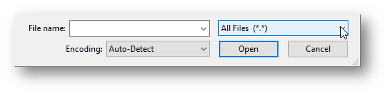

tldr:

- Computers process and store everything as **binary**. 
- **Codes** are used to represent one thing (e.g., a character) as something else (e.g., a number)
- **ASCII** and **Unicode** (UTF-8) are two common ways of coding text as numbers. Unicode includes ASCII as well as nearly all other languages known to exist. 
- Both files and variables within data files have **types** that specify how to interpret the binary. 

<!--more-->

Many people who use digital research methods in academia do not have a computer science or programming background. But, to understand how to work with data, a certain base level of knowledge is useful. This article is my attempt to explain the minimum knowledge researchers should have about character encodings. Although some content is specific to software for statistical analysis, much is also relevant to those in the digital humanities.  

## Background

For a deeper but more pictorial introduction to the following topics, see Kahn Academy's [Data & Binary](https://www.khanacademy.org/computing/computer-science/computers-and-internet-code-org/how-computers--work/v/khan-academy-and-codeorg-binary-data) video which discusses why computers use binary, describes the binary number system, and introduces how computers represent text, images, and sounds with numbers. Or, learn about the same topics (plus Hexadecimal) by reading [Binary and data representation](https://www.bbc.co.uk/bitesize/topics/zd2xsbk) from BBC's Bitesize GCSE Lessons. 

### Computers and Binary

Computers store and represent information using electricity in transistors, which can have only two states: **on** and **off**.

#### Binary

It is common to represent those two states in **Binary** as `1` and `0`.  By combining many `1`'s and `0`'s, the [**binary number system**](https://www.mathsisfun.com/binary-number-system.html) can represent larger numbers. For instance `1101` is 13, and `1100 1000` is 200.  

Some terminology: 

- [**bit**](https://en.wikipedia.org/wiki/Bit): Each `1` or` 0` is called a "**bit**", from <u>**bi**</u>nary dig<u>**it**</u>.  
- [**byte**](https://en.wikipedia.org/wiki/Byte): A group of **8 bits** together is called a "**byte**", ex. `1100 1000`

Storing 200 (`1100 1000`) takes 1 byte, as it needs 8 bits (binary digits). A byte has 256 different possible values and is a common way to group bits. 

The binary number system is only one of many ways that a computer could interpret the meaning of bits. But, it is a clear, simple, and mathematically useful way of doing so. 

#### Hexadecimal

Writing binary can get tedious, so it is far more common to write in hex. [**Hexadecimal**](https://www.mathsisfun.com/hexadecimals.html) is a base-16 system, in which each character can have 16 values (represented with`0`-`9` + `A`-`F`). Thus, 2 hex characters can represent 1 byte (8 bits).  For example, the decimal number 200 is `C8` in hexadecimal (also written `0xC8`).  

> `1100 1000` (binary) = C8 (hexadecimal) = 200 (decimal)

#### Codes and Coding

Since computers can only store and process `1`'s and `0`'s, and by extension larger numbers, how does it do so many things? 

Consider [**Morse Code**](https://en.wikipedia.org/wiki/Morse_code), developed over a century before computers. Messages were sent by using long or short burst of sound or the direction a line leaned. When people agreed on which sequences represented each letter and number (the "code"), they could communicate over long distances. 

There are standard ways to represent text, images, and video using numbers, called **encodings**, which allows programs to store, retrieve, and process all those things with others. This article will only address the representation of text. See the resources at the beginning of this section to learn more about other data types. 

### Text Encoding Schemes

Like Morse Code, people have worked together to develop standards for how bits and bytes are codes for (represent) text.

#### ASCII

**ASCII** (pronounced "ask-ee") was one of the first text coding schemes to get wide use, and is important because current schemes still use it. Characters that were needed was assigned a value from 0 to 127. In binary, that takes 7-bits, and the final bit of the byte was used for error checking. 

The 128 **codes** in ASCII include only the most basic characters in American English. For example, 37 is "%", 65  is "A", and 97 is "a". For the full list, see an [ASCII Conversion Chart](http://web.alfredstate.edu/faculty/weimandn/miscellaneous/ascii/ascii_index.html).  The numbers 0 through 32 are codes for non-printing "[Control Characters](https://en.wikipedia.org/wiki/Control_character)", including obsolete commands like a bell/beep, but also the horizontal tab (9) and the space (32). 

Each **number** also has a code. For example, 48 is "0", 49 is "1", and so on. Those codes are not completely arbitrary. In binary, 49 is `0011 0001`. The last 4 bits (`0001`) is 1, and thus matches the number. The last 4 bits of "A" and "a" are both `0001` as well. 

It is important to understand that **a number can be a character** like any letter *and* thus encoded as a different number. Software must be able to determine whether to interpret `0011 0001` as 49 or "1", or something else entirely.  It is convention to put the *encoded* character representation in quotes, and leave the direct numeric representation bare. 

#### Extended ASCII

As computers became more reliable, error checking became unnecessary and people realized they could represent additional characters (and languages) by using the 8th bit. Most of these [**code pages**](https://en.wikipedia.org/wiki/Code_page#Windows_.28ANSI.29_code_pages) just added new characters, but not all. Even with many more languages represented, only one could be used in any given document. With only 256 total characters allowed, it was difficult, if not impossible, to write documents in multiple languages, or in many Asian languages. 

Even if you never come across a file that was encoded with one of these code pages, you will see references to them. The most common English/Latin standards were **[ISO-8859-1](https://en.wikipedia.org/wiki/ISO/IEC_8859-1)** (aka "Latin-1"and the equivalent **[Windows-1252](https://en.wikipedia.org/wiki/Windows-1252)** (not identical, but close enough). The term [ANSI](https://en.wikipedia.org/wiki/Code_page#Windows_.28ANSI.29_code_pages) may take on different meanings--just know that it represents a code page typically used by Windows. Anything with the prefixes [ISO, OEM, or Windows](http://www.iana.org/assignments/character-sets/character-sets.xhtml) is most likely a code page. 

#### Unicode

[**Unicode**](https://www.unicode.org/standard/WhatIsUnicode.html) was developed in 1991 to solve the above issues ("uni" = "one", "one code"). [The consortium](http://unicode.org/main.html) has assigned a code to each character in [nearly](https://www.nytimes.com/2017/10/18/magazine/how-the-appetite-for-emojis-complicates-the-effort-to-standardize-the-worlds-alphabets.html) [all of the world's languages](https://www.unicode.org/charts/). For compatibility, the first 127/256 codes were kept the same as ASCII and ISO-8859-1. It only reached [majority use](https://www.w3.org/International/questions/qa-who-uses-unicode) around 2008.  

Unicode values are written in *hexadecimal* and start with U+. So, "A" is still represented by the number 65, but is written U+0041 (4*16+1=65).  In many software, characters can be written with \x (ASCII) as `\x41` or  \u (Unicode) as `\u0041`. Unicode allows for [over a million codes](https://www.johndcook.com/blog/2019/09/02/number-of-possible-unicode-characters/): up to U+10FFFF, which takes 21 bits  (in software with an uppercase U and 8 digits, `\U0010FFFF`). Unlike in previous schemes, 1 byte is not necessarily 1 character. 

The primary codes are written using 4 hex digits, which allows for 65,536 characters. These include the characters for nearly all *modern* languages as well as many symbols. Six hex digits allows for archaic languages like cuneiform, [Emoji](https://www.nytimes.com/2017/10/18/magazine/how-the-appetite-for-emojis-complicates-the-effort-to-standardize-the-worlds-alphabets.html), and specialized symbols (ex. musical notes and playing cards: U+1F0A1= **🂡** ). If you know its code, you can directly type [any character into Microsoft Word](https://support.office.com/en-us/article/insert-ascii-or-unicode-latin-based-symbols-and-characters-d13f58d3-7bcb-44a7-a4d5-972ee12e50e0).

#### Unicode Implementations

Unicode is just a general term for this text encoding; there are multiple ways it can be implemented, with designations starting with UTF and UCS. **UTF-8** is the most-used because it allows ASCII characters to just take up 1 byte (8 bits). This means the file is *identical* to an ASCII-encoded file if only those characters are used. Because punctuation and all of HTML markup uses just ASCII characters, [UTF-8 is the standard](https://www.w3.org/International/questions/qa-choosing-encodings) on the internet. 

UTF-8 still supports all of Unicode, but just takes **additional bytes** to do so. It uses 2 bytes to represent the codes U+0080 to U+07FF, which includes [Latin languages](https://en.wikipedia.org/wiki/Plane_(Unicode)#Basic_Multilingual_Plane), plus Greek, Cyrillic and some Aramaic scripts. It takes [3 bytes](https://en.wikipedia.org/wiki/Comparison_of_Unicode_encodings) to represent the remaining codes up to U+FFFF, and 4 bytes past that. Thus UTF-8 is a [variable width](https://en.wikipedia.org/wiki/Variable-width_encoding) encoding. 

Another common standard, **UTF-16**, stores all characters up to U+FFFF in 2 bytes. In other words, UTF-16 would store ASCII characters in 2 bytes instead of 1, but those from U+0080 to U+FFFF in 2 bytes instead of 3. The main advantage is that each character is the same "length"--2 bytes (or it's multiple, 4 bytes, for the remaining characters). 

Computers do have finite storage and processing limits, even if quite large. Consequently, in general, using fewer bytes is useful for capacity and speed.  

## Relevance

### Non-English Languages

All Unicode/UTF schemes can store and display **any character in any language** with [quite limited exceptions](http://www.unicode.org/standard/unsupported.html) (ex. new languages). It even supports [right-to-left languages](http://unicode.org/faq/bidi.html). Thus, if a software supports Unicode, it can work with your data. Note that a given font may not include all characters. Plus, the software may not display menus and messages in your language. The latter requires understanding the meaning of the language and must be created individually. 

#### Byte ≠ Character

In software that has been around for many years, some standard string functions may assume that each byte is a single character, which can be untrue with Unicode text. So, there may be separate functions to deal appropriately with that issue. [SAS](https://documentation.sas.com/?docsetId=nlsref&docsetTarget=p1pca7vwjjwucin178l8qddjn0gi.htm&docsetVersion=9.4&locale=en0) created "K" functions, and [Stata](https://www.stata.com/features/overview/unicode/) created "u" functions. 

#### Normalization

A **[diacritic]((https://en.wikipedia.org/wiki/Diacritic) )** or **diacritical mark** is an accent or other sign added above or below a **base character** to change it's pronunciation:  e +  ́ = é . In Unicode, these can be represented as a single character (*composed*) or as multiple characters (*decomposed*). Further, the Unicode system groups characters by language and not-infrequently gives different codes to [seemingly-identical characters](https://en.wikipedia.org/wiki/Duplicate_characters_in_Unicode). 

Unicode makes the important distinction between characters that are **canonically equivalent** (look the same) and **compatible** (mean the same). The standard includes [normalization charts](http://www.unicode.org/charts/normalization/) for each language. Most statistical software has a function to utilize this: Stata has [ustrnormalize](https://www.stata.com/manuals/m-5ustrnormalize.pdf), SPSS has [NORMALIZE](https://www.ibm.com/support/knowledgecenter/SSLVMB_23.0.0/spss/base/syn_transformation_expressions_string_functions.html), R has the [stringi](https://cran.r-project.org/web/packages/stringi/index.html) package, and Python has the [Unicodedata](https://docs.python.org/3/library/unicodedata.html) package.  

#### Simplification

To further standardize text, some may wish to remove accents, or use other methods of [romanization](https://en.wikipedia.org/wiki/Romanization) (using only Latin characters). Importantly, these techniques can [remove important differences between words](https://www.w3.org/International/wiki/Case_folding). General translation or replacement functions can accomplish this by specifying your own list of replacements. However, others have created tools to do this for most languages. 

**Removing accents** and reducing all characters to their base (á to a) is very common. Indeed, [people often assume](https://alistapart.com/article/accent-folding-for-auto-complete/) that searching for *resume* will give results that include *résumé*.  To do this, convert from Unicode encoding to ASCII encoding or using string substitution with regular expressions as illustrated in [this post using Stata](https://www.statalist.org/forums/forum/general-stata-discussion/general/1487336-remove-accents-on-a-string-variable-in-stata). SAS also has a [BASECHAR](https://documentation.sas.com/?docsetId=nlsref&docsetTarget=p078j5y1bbc9xfn1scp11kw3nmnt.htm&docsetVersion=9.4&locale=en) function

**Romanization**, which includes **[transliteration](https://en.wikipedia.org/wiki/Transliteration)**, means to represent the approximate sound of characters using the Roman alphabet (i.e., Latin). For example, Beijing is a particular [Pinyin](https://en.wikipedia.org/wiki/Pinyin) transliteration of the Chinese characters 北京. R has the [stringi](https://cran.r-project.org/web/packages/stringi/index.html), [pinyin](https://cran.r-project.org/web/packages/pinyin/index.html), and [UnidecodeR](https://www.rdocumentation.org/packages/UnidecodeR/versions/0.02) packages, Python has the [polyglot](https://pypi.org/project/polyglot/) and [Unidecode](https://pypi.org/project/Unidecode/) packages, but you can also [create your own transformation](https://programminghistorian.org/en/lessons/transliterating). 

### Decoding Issues

Errors in decoding will at least produce obvious errors, with garbled or coded characters. But, because these make the data uninterpretable by people, it is important to use the correct scheme to encode and decode your data. Since basic Latin/English letters and numbers have the same code in most-used schemes, those do not typically lead to problems. But, it is not uncommon to see garbled (ex. ƒ, �) or coded characters (ex. `\x99`) in data. 

Unicode does compile information about how different [programming languages use Unicode](https://unicodebook.readthedocs.io/programming_languages.html). If you will be working often with non-English languages, you should read the documentation and learn more about details that were not covered here.  In particular, Python users need to understand the difference between regular [unicode strings](https://docs.python.org/3/howto/unicode.html) ('A') and byte strings (b'A'). 

#### Common Errors

The most common noticeable error with standard text seems to be with single or double **quote marks**. Modern word processing software often inserts "[smart quotes](https://support.office.com/en-us/article/smart-quotes-in-word-702fc92e-b723-4e3d-b2cc-71dedaf2f343)" that have [different opening and closing versions](https://www.cl.cam.ac.uk/~mgk25/ucs/quotes.html). But, as these characters were introduced in Unicode, they will appear as 2 or 3 garbled characters if decoded otherwise. 

Unicode files may also have a **[byte order mark (BOM)](https://en.wikipedia.org/wiki/Byte_order_mark)** at the beginning specifying the format (some details, like endianness, are not addressed here). It is not always used, in part because it may be [interpreted as a weird character](https://www.johndcook.com/blog/2019/09/07/excel-r-bom/). 

See also the "[Big List of Naughty Strings](https://github.com/minimaxir/big-list-of-naughty-strings)" which includes many Unicode characters that have been known to cause problems with software. 

### File Types

The makers of a software decide whether the files it produces should be saved and interpreted according to ASCII/Unicode rules or not. If so, `11001000` will be "A" and so on. But, that same byte could represent anything the programmer desires. That leads to the two types of files: 

- **Text files** are intended to be decoded into readable characters using one of the standardized text coding schemes
- **Binary files** are not. The bits or bytes can take on any meaning. 

#### Text File Extensions

Many (many) different types of files are **Text** and can be easily examined in a [text editor](https://www.computerhope.com/jargon/e/editor.htm). Examples include: 

- **Script files:** .R, .py, .bat, .sps, .do, .sas, .sql
- **Data files:** .csv, .tab, .tsv, .por, .json, .xml
- **Document files:** .rtf, .ipynb, .md, .rmd, .html, .log, .tex
- **many others:** .ris, .bib, .eml, .ics

Most of these text files also include Markup](https://en.wikipedia.org/wiki/Markup_language) that gives information to software on how the text is structured or how it should display. When you open the file in a text editor instead of the designated software, you can see and edit the instructions along with the content. 

#### Determining File Type

Operating systems are built to automatically open each file with the intended software, and do not indicate whether a file is Text or Binary. But, it is a useful characteristic to know. **To find out**, try opening the file in a [text editor](https://www.computerhope.com/jargon/e/editor.htm) like Notepad (Windows), TextEdit (Mac), [Notepad++](https://notepad-plus-plus.org/) (Windows), [Atom](https://atom.io/), or even Microsoft Word. When doing so on a Windows computer, you may need to select "All Files" in the drop-down box on the lower right, as seen below. 

Once opened in a text editor, it is usually easy to tell if you are seeing the contents of a binary file: lots of gibberish on lines of widely varying size. A wrongly decoded document tends to have a more consistent structure and less gibberish. For reference, this is what a small section of a **binary pdf file** looks like when opened in Notepad++ (left) and Notepad (right). 

||

#### Long-term Preservation

**Text files** are typically preferred for [long term storage and preservation](https://www.ukdataservice.ac.uk/manage-data/format/recommended-formats) of data and documentation because the content can be read in a text editor even if the original software is unavailable. However, even though pdf files are binary, it is a [good preservation format](https://www.loc.gov/preservation/digital/formats/fdd/fdd000318.shtml) because is an open standard and well-supported.  

**Data files** produced by statistical software are typically binary (ex. .sav, .dta, .sas7bdat). Although it is good to preserve the original file because it contains additional metadata, it is best to also save data in a text format. The most common are "[delimited](https://en.wikipedia.org/wiki/Delimiter-separated_values)" files where the columns are separated by a symbol such as a comma, tab, or pipe "|"). For example, the file extension .csv refers to **c**omma-**s**eparated **v**alues. SPSS's portable .por file is also in text format as it was meant for data transfer. By default, R will write binary data files, but the functions have an option to use ASCII instead. Because these text formats do not store labels and other data information, be sure to make a codebook and store it with the file. 

### Variable Types

Just as each file is either Text or Binary, every variable in statistical software has a **type** (*aka* class or encoding), which specifies whether the stored binary values for that variable are interpreted as numbers or treated as codes for their ASCII/Unicode text characters. 

Here are the terms each software gives to the types: 

| Software                                          | Number                         | Text            |
| ------------------------------------------------- | ------------------------------ | --------------- |
| SPSS                                              | numeric                        | string          |
| Stata                                             | byte, int, long, float, double | str / string    |
| SAS                                               | numeric                        | character       |
| R                                                 | int, num / numeric             | chr / character |
| [Pandas](https://pbpython.com/pandas_dtypes.html) | int64, float64, bool           | object          |

When a software has **multiple number types**, they differ in the number of bytes used and whether it stores decimals or just integers. In Stata, for example, the "byte" type uses 1 byte and will only store integers between -127 and 100 (recall 8 bits has 256 combinations).  The long and float types each use 4 bytes (integers vs decimals respectively), and the double uses 8 bytes (necessary for date-time variables). All other data types in statistical software (ex. date or currency) are based on one of the the number types, with formatting or further interpretation. 

The number (unencoded) representation is **better for data** where possible. As you have seen, the number 123 can be stored in 1 byte, whereas "123" would use 3 bytes (ASCII characters 49 50 51). Further, " 123 " would use 5 bytes (32 49 50 51 32) and would not be considered equal. To remove extra spacing and unseen characters, look for software functions named **Trim** and **Clean**. 

In all software, it is necessary to surround string values with quotes or it is interpreted as a command or other keyword. In SPSS, Stata, and SAS, specify an empty (missing or null) string value by typing two quotes together `""` with nothing in between. To specify an empty numeric value, use the convention for your software: SPSS `$Sysmis` , Stata `.` , SAS `.` , R `NA` , [Pandas](https://pandas.pydata.org/pandas-docs/dev/user_guide/missing_data.html#missing-data-na) `NaN`. In R, `NA` (with no quotes) can also be used for character-type variables. 

#### Numbers + Text

All statistical software also has a way of combining the usefulness of text and numbers for variables with a defined set of values. This is particularly important for [Ordinal variables](http://homes.chass.utoronto.ca/~josephf/pol242/4LevelsofMeasurement.htm): categorical variables that have a specific natural order. Each value does have a non-numeric meaning, but numbers are important to control ordering. 

**SPSS**, **Stata**, and **SAS** all allow numeric variables to have **labels** for each numeric value. Those labels are displayed in output either alone or alongside the number value. But, for data management and calculation purposes, the variable is treated the same as other numeric variables. Thus, it is necessary to refer to the number value when grouping or recoding and ensure it is treated as categorical in analyses.  

**R** has a special data type called **factor**. Although there is an underlying numeric value, it is relevant only for ordering and regression contrasts. For data management purposes, the value is  specified using its textual label. Factors are treated appropriately as categorical for statistics and visualizations. **Pandas** in Python has the **category** data type. It is treated much like the Text/object variable type even though it also has an underlying numeric representation. It treats the variable similar to other objects in analyses (e.g.,you must still dummy code).  

Converting text variables into numbers + text means that the text label needs only to be **stored once** and the stored number value is just 1 byte (allows integers up to 255).  This is one of the best ways to increase the speed of your data analysis because it can drastically reduce the amount of information (bytes) that the computer must process and store. 

#### Codes and Coding

The concept of **Codes** and **Coding** is a huge part of any data work. Just like representing the letter "A" with the number 65, it is common to represent groups of observations with numbers (as in the previous section). Those numbers also also referred to as codes.  Words like **en**code, **de**code, and **re**code all refer to this, both with files and variables.

|What|Definition|For Files|For Variables|
| ------ | ----------------------------- | --------------------------- | ---------------------------------------------------------- |
| Encode | replace text with a code | save; turns what we see into bits | assign each text value a number and add the text as labels |
| Decode | replace a code with it's meaning | open; allow us to read it | turn the labels to numbers back into a text value |
| Recode | change the assigned codes | called "convert" | combine or re-order groups |

## Conclusion

Research is now more dependent on computers than ever. Knowing some basic computer concepts will help understand the logic of some software elements that confuse many new researchers. 

### Further Reading

- [The Absolute Minimum Every Software Developer Absolutely, Positively Must Know About Unicode and Character Sets (No Excuses!)](https://www.joelonsoftware.com/2003/10/08/the-absolute-minimum-every-software-developer-absolutely-positively-must-know-about-unicode-and-character-sets-no-excuses/)
- [How Unicode Works: What ever devloper needs to know about strings and 🦄](https://deliciousbrains.com/how-unicode-works/)
- [What Every Programmer Absolute, Positively Needs to Know About Encodings and Character Sets to Work With Text](https://kunststube.net/encoding/)
- [An Encoding Primer](https://danielmiessler.com/study/encoding/)
- [Unicode, UTF8 & Character Sets: The Ultimate Guide](https://www.smashingmagazine.com/2012/06/all-about-unicode-utf8-character-sets/)
