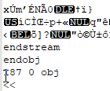

tldr:

- Computers store everything as binary numbers. 
- Codes are what we use to represent one thing (e.g., a character") as something else (e.g., a number)
- All text characters in computers are coded as numbers. There are various coding schemes that turn numbers into those characters. 
- Computers need to know whether to interpret that number as a number, or as the character it represents (ex. 49 is the code for the character "1"). 
- Both files and variables within data files have types that indicate how to interpret the computer's representation. 

<!--more-->

## Background

For a deeper and more pictoral introduction to the following topics, see Kahn Academy's [Data & Binary](https://www.khanacademy.org/computing/computer-science/computers-and-internet-code-org/how-computers--work/v/khan-academy-and-codeorg-binary-data) video which discusses why computers use binary, introduces the binary number system, and introduces how computers represent text, images, and sounds with numbers. Or, learn about the same topics (plus Hexadecimal) by reading [Binary and data representation](https://www.bbc.co.uk/bitesize/topics/zd2xsbk) from BBC's Bitesize GCSE Lessons. 

### Computers and Binary

Computers store and represent information using electricity in transistors, which can have only two states: "on" or "off".

#### Binary

It is common to represent those two states in **Binary** as `1` and `0`.  By combining many 1's and 0's, the binary number system can represent other numbers. For instance `1101` equals 13, and `1100 1000` equals 200.  Brush up on how the binary number system works [here](https://www.mathsisfun.com/binary-number-system.html). 

Some terminology: 

- [**bit**](https://en.wikipedia.org/wiki/Bit): Each `1` or` 0` is called a "**bit**", from <u>**bi**</u>nary dig<u>**it**</u>.  
- [**byte**](https://en.wikipedia.org/wiki/Byte): A group of **8 bits** together is called a "**byte**", ex. `1100 1000`

Storing the number 200 (`1100 1000`) takes 1 byte, because it needs 8 bits (binary digits). A byte has 256 different possible value combinations. 

Of course, the bits need not be interpreted using the binary number system, as it is just one of many options. But, it is a clear, simple, and mathematically useful way of doing so. 

#### Hexadecimal

Writing in binary can get tediuous, so it is far more common to write in hexadecimal. **Hexadecimal** is a base-16 system, in which each character can have 16 values (0-9 + A-F). Thus, 2 hex characters can represent 1 byte (8 bits).  For example, the decimal number 200 is C8 in hexadecimal (also written 0xC8).  Brush up on Headecimal [here](https://www.mathsisfun.com/hexadecimals.html). 

> 11001000 (binary) = C8 (hexadecimal) = 200 (decimal)

#### Codes and Coding

Since computers can only store and process 1's and 0's, and by extension numbers, how does it do so many things? By coding. 

Consider [**Morse Code**](https://en.wikipedia.org/wiki/Morse_code), developed over a century before computers. Messages were sent by using long or short burst of sound or other 2-option signals. When people agreed on which sequences representd each letter and number, they could communicate over long distances. 

Because people have agreed about how to represent text, images, and video using numbers (and thus ultimately binary), we can share all those things with others using computers. This post will only address how text is represented with codes. If you are interested in lerning more about the codes used to store and transmit images and/or audio, see the additional resources listed at the beginning. 

### Text Encoding Schemes

Like morse code, people have worked together to develop standards for how the bits and bytes should be decoded into text. 

#### ASCII

**ASCII** (pronouced "ask-ee") was one of the first text coding schemes to get wide use, and it is important because current schemes are compatible (i.e., incorporate it). Each character was assigned a value from 0 to 127. That takes 7-bits to write in binary, and the final bit of the byte was used for error checking. 

The 128 **codes** in ASCII include only the most basic characters in American English. For example, 37 is "%", 65  is "A", and 97 is "a". For the full list, see this [ASCII Conversion Chart](http://web.alfredstate.edu/faculty/weimandn/miscellaneous/ascii/ascii_index.html).  The numbers 0 through 32 are codes for non-printing "[Control Characters](https://en.wikipedia.org/wiki/Control_character)", including obsolete commands like a bell/beep, and a few important but non-visible "characters", like the horizontal tab (9) and the space (32). 

Each **number** also has a code. For example, "0" is 48, "1" is 49, and so on. Those codes are not as arbitrary as they may seem. In binary, 49 ("1") is `0011 0001`. The last 4 bits `0001` equal 1, and thus are the same as the number. The last 4 bits of "A" and "a" are both `0001` as well. 

That **a number can be a character** like any letter *and* encoded as a different number is a crucial concept. Software must be able to determine whether to interpret `0011 0001` as 49, or "1", or something else entirely.  When discussing these issues, it is convention to put any encoded character representation in quotes, and leave the numeric representation bare. 

There were **two problems with ASCII**. The first was that error checking became unecessary as computers became more reliable, which meant that a whole bit was essentially unused. Secondly, since ASCII only included the base English letters, people who wrote in other langauges (or who wanted to properly write certain names), were out of luck. 

#### Extended ASCII

Incorporating the 8th bit, many people made their own **their own coding schemes**, called "**code pages**", for the values 128 through 256. Most kept ASCII's codes and just added more, though some changed some of the first 128 as well. Since there are many different languages, there were many code pages developed. However, only one code page could be used in any given document. Thus, it was difficult, if not impossible, to write documents in multiple languages, or in many asian lanaguages which have more than 256 characters . 

Although these are no longer the standard, many existing documents had used them and references to them are not unforseeable. Those 256-character code pages were given identifiers with prefixes such as [ISO, OEM, and Windows](http://www.iana.org/assignments/character-sets/character-sets.xhtml). The most common English/Latin standards were **[ISO-8859-1](https://en.wikipedia.org/wiki/ISO/IEC_8859-1)** and the equivalent **[Windows-1252](https://en.wikipedia.org/wiki/Windows-1252)** (not the same, but close enough). The term ANSI (which stands for American National Standards Institute) is sometimes [incorrectly used](https://en.wikipedia.org/wiki/ANSI_character_set) in place of either or both (given their similarity). 

#### Unicode

**Unicode** was developed to be a comprehensive solution to the problems with ASCII ("uni" = "one", "one code"). The organization assigned a code to each character in all of the world's lanugages. For compatibility, the first 127/256 codes were kep to be the same as ASCII and ISO-8859-1. The first version of their standard was released in 1991 but Unicode only reached [majority use](https://www.w3.org/International/questions/qa-who-uses-unicode) around 2008. 

Unicode values are written in Hexadecimal and start with U+. So, "A" is still represented by the number 65, but is written U+0041 (4*16+1=65). The character "1" is still 49, written U+0031. These can be represented in 1 byte,  just like before.  

Unicode added 2-byte codes (4 hex digits, 16 bits) which allows a total of 65,536 codes (0 to 65,535). The codes from 256 up include the characters for nearly all modern langauges as well as many symbols.  But, Unicode [did not stop there](https://en.wikipedia.org/wiki/Plane_(Unicode))--there are also 3-byte codes, which allow for archiaic languages like cuneiform, specialized symbols (ex. musical notes and playing cards) and many Emoji. For instance, U+1F0A1 is the ace of spades: **🂡**. If you know the code, you can type [any character into Microsoft Word](https://support.office.com/en-us/article/insert-ascii-or-unicode-latin-based-symbols-and-characters-d13f58d3-7bcb-44a7-a4d5-972ee12e50e0).

**UTF-8** is the most-used implementation of Unicode in the United States because it allows the 1-byte charaters to just take up 1 byte (8 bits). This means the file is identical to an ASCII or ISO-8859-1 file if only 1-byte characters are included. UTF-8 still supports all of Unicode, but takes an *extra* byte to indicate the presence of each 2 or 3 byte character. Another common standard, UTF-16, stores *both* 1- and 2-byte chracters in 2 bytes. UTF-16 makes files unnecessarily bigger when almost all characters are Latin/English (2 bytes per character instead of 1), but it will ultimately be a smaller file for other languages (2 bytes per character instead of 3). Plus, UTF-16 files can only be correctly decoded by software that supports Unicode. Instead of "UTF", you may also see "UCS "(ex. UCS-2) which are also Unicode. 

## Whay does this Matter for Data Analysis?

### Software

As long as a software supports Unicode in some way, it can store and display text data from essentially any langauge. All Unicode/UTF schemes can represent **any character in any language** with [quite limited exceptions](http://www.unicode.org/standard/unsupported.html) (ex. new lanaguges). It even supports [right-to-left languages](http://unicode.org/faq/bidi.html). 

Whether the software can display **menus and messages** in that language is language-specific. Those require understanding the meaning of the language and must be created individually. You will have to check the software documentation to see exactly what features it provides for each language.

Uncode has also established a system of "normalization", which identifies similar characters and can help standardize data by **removing accented characters** (ex. á to a). See the [normalization charts](http://www.unicode.org/charts/normalization/) for each language. There are many tools to do this, and each statistical software also has this function. Stata has [ustrnormalize](https://www.stata.com/manuals/m-5ustrnormalize.pdf), SPSS has [NORMALIZE](https://www.ibm.com/support/knowledgecenter/SSLVMB_23.0.0/spss/base/syn_transformation_expressions_string_functions.html), SAS has [BASECHAR](https://documentation.sas.com/?docsetId=nlsref&docsetTarget=p078j5y1bbc9xfn1scp11kw3nmnt.htm&docsetVersion=9.4&locale=en), R has the [UnidecodeR](https://www.rdocumentation.org/packages/UnidecodeR/versions/0.02) package, and Python has the [Unidecode](https://pypi.org/project/Unidecode/) package. 

### Files

The makers of a software decide whether the files it produces should be saved and interpreted according to ASCII/Unicode rules or not. If so, `11001000` will be "A" and so on. But, that same byte could represent  anything the programer desires. That leads us to the two types of files: 

- **Text files** are intended to be decoded into readable characters using one of the standardized text coding schemes
- **Binary files** are not 

#### Text File Extensions

Many (many) different types of files are **Text** and can be easily examined in a text editor. Examples include: 

- **script files:** .R, .py, .bat, .sps, .do, .sas, .sql
- **data files:** .csv, .tab, .tsv, .por, .json
- **document files:** .rtf, .ipynb, .md, .rmd, .xml, .html, .log, .tex
- **many others:** .ris, .bib, .eml, .ics

Many of these text files also include symbolic [Markup](https://en.wikipedia.org/wiki/Markup_language) that gives instructions to the indended software on how to display. Many people are familiar with HTML, which is a type of Markup. When you open the file in a text editor instead, you can see and edit the instructions along with the content. 

#### Determining File Type

Operating systems are built to automatically open each file with the intended software, and do not indicate whether a file is Text or Binary. But, it is a useful characteristic to know. **To find out**, try opening the file in a [text editor](https://www.computerhope.com/jargon/e/editor.htm) like Notepad (Windows), TextEdit (Mac), [Notepad++](https://notepad-plus-plus.org/) (Windows), [Atom](https://atom.io/), or even Microsoft Word. When trying to open the file on a Windows computer, you may need to change the dialog box to show "All Files" by choosing that from the drop-down box in the lower right, as seen below. 

Once opened in a text editor, it is usually easy to tell if you are seeing the contents of a binary file: there is a lot of gibberish on lines of widely varying size, sometimes interspersed with english instructional words. Although you might also see gibberish if the text editor wrongly decodes a document, this happens rarely and looks different. For reference, this is what a small section of a **binary pdf file** looks like when opened in Notepad++ (left) and Notepad (right). 

||

#### Long-term Preservation

**Text files** are typically preferred for long term storage and preservation of data and documentation because the content can be read in a text editor even if the original software is unavailable. However, even though pdf files are binary, it is a [good preservation format](https://www.loc.gov/preservation/digital/formats/fdd/fdd000318.shtml) because is an open standard and well-supported.  

**Data files** produced by statistical software are typically binary (ex. .sav, .dta, .sas7bdat). Although it is good to preserve the original file because it contains additional metadata, it is best to also save data in a text format. The most common are "[delimited](https://en.wikipedia.org/wiki/Delimiter-separated_values)" files where the columns are separated by a symbol such as a comma, tab, or pipe "|". For example, the file extension .csv refers to **c**omma-**s**eparated **v**alues. SPSS's portable .por file is also in text format as it was meant for data transfer. By default, R will write binary data files, but the functions have an option to use ASCII instead. Because these text formats do not store labels and other data information, be sure to make a codebook and store it with the file. 

#### Decoding Issues 

When text is decoded improperly, the most common noticable error seems to be with single or double **quote marks**. Modern software often inserts "[smart quotes](https://support.office.com/en-us/article/smart-quotes-in-word-702fc92e-b723-4e3d-b2cc-71dedaf2f343)" that have [different opening and closing versions](https://www.cl.cam.ac.uk/~mgk25/ucs/quotes.html). But these characters were not available until Unicode and are 2 bytes (total of 3 bites if encoded as UTF-8). So, they will appear as 2 or 3 weird characters if decoded by older software or any system not using Unicode. 

Unicode files support putting a special character, called a **[byte order mark (BOM)](https://en.wikipedia.org/wiki/Byte_order_mark)**, at the beginning to indicate a file is Unicode and which flavor (some options, like endianness, are not addressed here). It is sometimes not used, in part becuase software that reads the file as ASCII would [interpret it as a weird character](https://www.johndcook.com/blog/2019/09/07/excel-r-bom/). If you see a weird character at the beginning and know it is from the BOM, consider whether your file has non-ASCII characters. If so, then make sure you specify the correct decoding (ex. "UTF-8 BOM"). If not, you can safely delete that weird character. 

UTF-8 is called **variable-length** because the characters may take up 1 byte, 3 bytes, or 4 bytes. Since characters are not the same as bytes, this could potentially make it more difficult for string decoding and processing. There is some speculation that it might take less time to decode a file as ASCII because of this. 

### Variables

Just like each file is either Text or Binary, every variable in statistical software has a **type** (sometimes also called class or encoding). That includes whether the stored binary values in that variable are interpreted as numbers or treated as codes for their ASCII/Unicode text characters. 

Here are the terms each software gives to the types: 

| Software                                          | Number                         | Text            |
| ------------------------------------------------- | ------------------------------ | --------------- |
| SPSS                                              | numeric                        | string          |
| Stata                                             | byte, int, long, float, double | str / string    |
| SAS                                               | numeric                        | character       |
| R                                                 | int, num / numeric             | chr / character |
| [Pandas](https://pbpython.com/pandas_dtypes.html) | int64, float64, bool           | object          |

When there are **multiple number types**, they differ in the number of bytes used and whether it stores decimals or just integers. All other data types (ex. date or currency) are based on one of the the number types, with formatting or further interpretation. In Stata, for example, the "byte" type uses 1 byte (8 bits) and will only store integers between -127 and 100 (recall 8 bits has 256 combinations).  The long and float types each use 4 bytes (integers vs decimals respectively), and the double uses 8 bytes.  

If you try to store a very large number in a type that is **too small,** you will lose information. In Stata, for instance, if you are creating a date-time variable it is crucial that you specify the type as double. By default, Stata uses the float type, which does not have enough bytes to store the time precicely. Like other software, Stata helpfully has a compress command that will optimize variable storage. The command has no downside as it cannot cause data loss. Thus, it should be run after creating many new variables. 

The number (unencoded) representation is **better for data** where possible. As you have learned, the number 123 can be stored in 1 byte, whereas "123" would use 3 bytes (ASCII characters 49 50 51). Further, " 123 " would use 5 bytes (32 49 50 51 32) and not be considered equal to "123". The extra spaces do not provide additional meaning, but are still encoded characters. Software functions that will remove extra spacing and unseen characters are often called "trim" or clean". 

#### Numbers + Text

All statistical software also has a way of combining the advantages of text and numbers for variables that have a defined set of values. This is particularly useful for [Ordinal variables](http://homes.chass.utoronto.ca/~josephf/pol242/4LevelsofMeasurement.htm): categorical variables that have a specific natural order. Each value ("level") does have a non-numeric meaning, but numbers are important to control ordering. Software thus stores these variables as a number (or code) and then the coding scheme linking the numbers to specific text. 

SPSS, Stata, and SAS all allow numeric variables to have **labels** for each value. Those labels are displayed in output (either alone or alongside the number value). But, for data management and calculation purposes the variable is treated identically to other numberic variables. Thus, it is necessary to refer to the number value when grouping or recoding and regression dummy coding must be done specifically. 

R has a special data type called **factor**, which allows it to go beyond just numbers with labels. Such variables are treated appropriately as categorical for statistics and visualizations. For data management purposes, the value must be referred to using its textual label. Thus, the number value is relevant only for ordering purposes.  Pandas in Python has the **category** data type. It is treated much like the Text/object varaible type. It does not automatically structure the variable for analysis like R, such as dummy coding. 

Making text variables into numbers + text means that the text label needs only to be **stored once** and the stored number value is just 1 byte.  This is one of the best ways to reduce the amount of information (bytes) that the computer must process and store and thus increase speed. This is especially true if you have a many rows or long text labels or a computer with low memory (RAM). 

#### Codes and Coding

The concept of **Codes** and **Coding** is a huge part of any data work. Just like representing the letter "A" with the number 65, it is common to represent groups with numbers as in the previous section. Those numbers also also referred to as codes.  Words like **en**code, **de**code, and **re**code all refer to this concept, both with files and variables. **Encoding** means to assign or replace something with a code. When we save a file, this is what happens--it turns what we have seen and written into bits. When we encode a variable, we assign each Text value a number and add the Text as labels. **Decoding** means to replace or substitute the code with it's meaning so that we can more easily understand it. When we open a file, it is decoded so that we can read it. When we decode a variable, we turn the labels to numbers back into Text value. This can be useful when combining files with different encoding. **Recoding** means to change the codes that were assigned. This is one of the common tasks with variables to combine or re-order groups. For files, though, changing the way that codes are interpreted is called converting. 

## More Reading

- [The Absolute Minimum Every Software Developer Absolutely, Positively Must Know About Unicode and Character Sets (No Excuses!)](https://www.joelonsoftware.com/2003/10/08/the-absolute-minimum-every-software-developer-absolutely-positively-must-know-about-unicode-and-character-sets-no-excuses/)
- [How Unicode Works: What ever devloper needs to know about strings and 🦄](https://deliciousbrains.com/how-unicode-works/)

But, if you open a file and the software does not recognize a code, it is most likely to display a question mark in a diamond U+FFFD. �