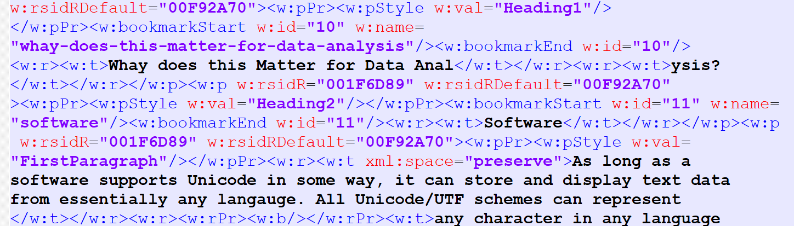

This series is meant for non-programmer researchers who are beginning to use text-based tools and syntax. 

tldr:

- Digital Researchers need to understand the different types of files they work with. 
- Many people make use of Markdown languages without understanding that they are just a part of the Markup ecosystem. 
- The escape character <kbd>\\</kbd> switches a language interpreter between interpreting characters as text and as a special character. 
- Many researchers do not have a programming background and may not be familiar with some concepts. 

<!--more-->

Many people who use digital research methods in academia do not have a computer science or programming background. But, to understand how to work with data and to take advantage of tools for collaboration and replicability, a certain base level of knowledge is useful. This article is my attempt to explain the minimum knowledge researchers should have about text files and the various types of markup. Although some content is specific to tabular data and statistical software, much is also relevant to those in the digital humanities.  

## Text Files

In general, there are three main types of text files (those which can be read by a [text editor](https://www.computerhope.com/jargon/e/editor.htm)), based on how the text is interpreted.  This taxonomy is simply what I think is useful for researchers. 

- **Script** - This contains the code for a programming language. 
- **Document** - For the display of textual documents for reading.  
- **Data** -  For structured text or numeric data. 

==Data Document and data file Text files become even more useful when combined with Markup, which refers to characters that provide instructions for interpreting or displaying content in a particular way. Markup uses human-readable characters to specify that formatting or structure. Some rules and sequences are more complex and some are simpler. At the same time, complexity may allow for much more control over the output.== 

==Markup itself is often classified into [three types](https://en.wikipedia.org/wiki/Markup_language): presentational, procedural, and descriptive.== 

==Markup is extra characters utilize a standard scheme that is interpreted by software as structure, annotation, or display instructions.== 

### Version Control

[Version control](http://crlionline.net/node/198) systems like Git, Mercurial, and Subversion, are much more useful for Text Files versus Binary files. Although most will store both types files, one of the most useful features of such systems is the ability to show line-by-line changes between one version and the next. Files with markup allow for both rich or structured text and for text files. Thus, using a Markup file will all you to use all the benefits of a version control system. To show differences in binary files like microsoft word requires [converting it to a text format first](https://git-scm.com/book/en/v2/Customizing-Git-Git-Attributes). 

### WYSIWYG

Many people cannot remember the time when computers could only display plain text. To control the look of the document, users would add tags or control codes--essentially markup--to indicate how the document would look once printed.  When computer displays improved and software took advantage of it, visible markup was unneeded. Writers could make and *see* words bold on the screen, and *get* words in bold when printed--in other words "[What You See Is What You Get](https://bits.blogs.nytimes.com/2007/10/18/the-real-history-of-wysiwyg/)". These were thus called **Rich Text** or WYSIWYG editors and would typically save files in a binary format. 

>  "**W**hat **Y**ou **S**ee **I**s **W**hat **Y**ou **G**et" -> WYSIWYG ("wizzy-wig") 

The desire to see controlling markup has never become obsolete; many writers prefer to more precisely see and control such formatting instructions. Some poeple have described the constrast with Markup being "[What You See Is What You *Mean*](https://en.wikipedia.org/wiki/WYSIWYM)". 

## Scripts

*Every* programming script, **including those for statistical software**, is saved in text format. Thus, files of type .sps, .do, .sas, .R, .py, and .sql, can all be opened and written in any [text editor](https://www.computerhope.com/jargon/e/editor.htm).  

Programming languages are divided into **interpreted** and **compiled** languages. All statistical software uses interpreted languages. Compiled languages like C++ must be converted into binary files in order to run. This can vastly increase speed because the instructions have already been translated directly into computer language and thus do not need to be translated "at runtime" (while it is also following the instructions).  

### Editors and IDEs

The advantage of opening a text script file in specific editors is **syntax highlighting **, which refers to the coloring that highlights different aspects of the code, and **code completion**, which helps you remember and type variable and function names. Many text editors used by programmers support highlighting for many languages and allow users to create their own. Notepad++, for instance, can support all the languages by installing some user-contributed files. 

Every software language has a **structure** and it is crucial to understand it. Being able to look at someone else's syntax and pick out the important words. For traditional software it is usually the first word or few words. For the programming langauges (R & Python), it is important to identify the functions (before parentheses)

### Functions vs Comands

Function-based vs command-based langauges

There is disagreement over whether the syntax most people use with their statistical software are programming languges. 

Just like when learning a language, knowing the words is not good enough--indeed, that is what dictionaries can do. It is important to understand the grammar, how the words fit together. For example, as a consultant, it is useful for me to be able to say "Use the collapse command" or "add the detail option" 

### Statistical Software

Programming is focused on writing functions and loops and 

Programmers learn to print "Hello, World!", perform math, identify types and classes, and create functions. . Variables have a different mening, 

Most people who use R do not need to program. They need to import data, calculate statistics, draw graphs, 

Data Scientists start with graphing. 

Indeed, is is convention in R to avoid loops in favor of mapping or apply functions. I have seen many programmers of other languages loop through each row in a dataset, which is compltely unheard of for data-focused researchers. 

Coding is usiing written text to give a software instructions. 

The statistical softwares SPSS, Stata, and SAS each allow for more traditional programming, but the vast majority of what users will do is simpler type of coding. Moreover, the language for these software is intentionally simplified and targeted towards particular types of researchers doing the types of things they need to do. Because the langauges are focusing on for conducting statistical analysis, and are often confusing to those who try to .   but have their own logic that is easier for non-progg

https://towardsdatascience.com/10-not-so-intuitive-things-about-programming-with-r-a4d9d120c42c

https://blog.revolutionanalytics.com/2015/06/why-has-r-been-so-successful.html

https://www.computerworld.com/article/2497319/business-intelligence-beginner-s-guide-to-r-syntax-quirks-you-ll-want-to-know.html

https://codeandculture.wordpress.com/2010/08/06/some-ways-stata-is-an-unusual-language/

R has more similarities with traditional programming lagnaguges

People disagree over what defines a programming language. Statistical langauges do have traditional programming features like loops and functions, but the structure differs substantially. However, most users do not need those tools and instead are able to use the simplified tools.  The syntax for statistics-focused languages, though including 

Some would call Stata a scripting language vs a programing langauge. vs R and Python being functional languages. 

shares some features of other genreal purposes langauges, but has both similarities and differences from other general purpose languages (including Python).  

An experienced computer programmer would find  Regardless, each software does indeed have a syntax, with a structure and vocabulary, as well as loops and the ability to create your own functions.  programming languages.  the syntax for software like SPSS, Stata, and SAS are have many similarities. There is a structure, a vocabulary, and a way  Indeed, Stata makes it easy for users to extend it by [creating new commands](https://www.stata.com/features/community-contributed-commands/). 

## Documents

### HTML, XML, and XHTML

This family of markup languages are used both for documents and data (XML only). They are easy to identify from the **tags** surrounded by <>'s. For instance, to get the key image <kbd>Ctrl</kbd>, I type `<kbd>Ctrl</kbd>` (the *tag* is "kbd").  Another example is: 

```
This is some <strong>bold</strong> text. 
```

HTML (**H**yper**t**ext **M**arkup **L**anguage) was built to control the display of documents on the internet (hypertext by definition is text that links to other information) and has a defined set of tags (words) for that purpose. XML (e**X**tensible **M**arkup **L**anguage) is extensible, which means that it can use any set of tags. XHTML (e**X**tensible **H**yper**t**ext **M**arkup **L**anguage) is HTML based on XML instead of SGML, an older and more complex markup language that HTML also came from. See more about XML formats under Data. 

HTML uses pre-defined tags especially for displaying documents on the internet and was created in 1990. You cannot add your own tag names. Learn more about [HTML](https://www.w3schools.com/html/). 

### RTF / Rich Text Format

[Rich Text format](https://en.wikipedia.org/wiki/Rich_Text_Format) (RTF), was developed by Microsoft in 1987 as an text-based alternative for Microsoft's binary document format which would facilitate portability to other software. Indeed, it is supported by most all document editors. Markdown is now more popular due to its [relative] simplicity, but rtf may be the only choice (ex. Stata's estout). SPSS puts a .doc extension on their rtf exported output (accurately labeled "Word/RTF"). Either works.  

```
{\pard
This is some {\b bold} text.
}
```

### TeX / LaTeX

LaTeX (["lah-tech" or "lay-tech"](https://www.latex-project.org/about/)) is the oldest document markup scheme still in wide use, having been around since 1984. It provides a more comprehensive and user-friendly way of using TeX, which actually implements the markup. Researchers in the sciences use it to write papers with complex mathematical expressions. It can also make books and slides. 

```
This is some \textbf{bold} text. 
```

LaTeX syntax is similar to RTF in that there are many \\'s and {}'s, but notice that the brackets here are after the command name, not before. 

Learn more about [LaTeX](https://www.andy-roberts.net/writing/latex). 

### Markdown

Markdown was created in 2004 and has quickly gained users because it is "lightweight" (requires few markup characters) and easy to read as-is. For example, you put asterisks around a word to add emphasis. Markdown is most directly [compared to HTML](https://www.markdownguide.org/basic-syntax/) because many people who use it are ultimately creating websites. 

```
This is some **bold** text. 
```

Like ASCII, the [original implementation](https://www.markdownguide.org/cheat-sheet/) has been incorporated into many different "[flavors](https://github.com/commonmark/commonmark-spec/wiki/markdown-flavors)" with fancier features. Popular flavors include GitHub Flavored Markdown (GFM) and RMarkdown. Because the base Markdown is the same for all, most Markdown applications should suffice. Windows users can even save Microsoft Word documents in Markdown with an [add-on](http://www.writage.com/). 

## Data

### Tabular

Tabular data is organized into rows and columns, as in spreadsheets (ex. Excel) or statistical software (e.g., "data table").  Each row represents a "thing" (e.g., person, place, action). Columns typically have a header row that identifies the characteristics of that thing that are stored in each column (aka variable names). There are two ways that tabular data can be stored in text files. 

#### Fixed Format

Fixed format (*aka* Fixed width or Fixed length) files actually have no markup. Indeed, they mostly look like big blocks of numbers (or other characters) and *do not have variable names* in the first row. Instead, each variable was allocated a specific number of characters and can be identified by position. Back when hard drive space was precious, it was commonly used for data because delimiters were extra non-data characters and thus unneeded. 

The label ASCII does not itself specify fixed format (delimited data can also be encoded as ASCII), but is often listed as such. Similarly, a "flat file" refers to a single data table stored in a file in contrast to a multi-table database, but is sometimes used synonymously. 

To read this type of file, it is necessary to have a separate [setup file](https://www.icpsr.umich.edu/web/ICPSR/cms/1976) for a statistical software to know which data goes with which variable. 

#### Delimited

To delimit means to mark the boundaries of something. In delimited data files, the columns are separated with a character.  Any character can be used, but the most common **delimiters** in order of use are: 

| Delimiter                                              | Extension        | Notes                                                        |
| ------------------------------------------------------ | ---------------- | ------------------------------------------------------------ |
| Comma <kbd>,</kbd>                                     | .csv             | Most common format; computers automatically open this in Excel. |
| Tab  <kbd>Tab</kbd><br /> <kbd>\\</kbd>+<kbd>t</kbd>   | .tab, .tsv, .txt | Less common in text, so fewer conflicts. But, since tabs are not visible, can confuse some. |
| Pipe <kbd>\|</kbd><br /><kbd>Shift</kbd>+<kbd>\\</kbd> | .dat, <br />.txt | Rarely used in text and looks like a column break. But, lack of common use means it is less recognized and supported. |

Specifying a **text qualifier** (usually double quotes) may also be necessary. That will surround the text in each cell and is necessary if the data itself contains line breaks (\n) or the delimiter. If the data has quotes, then software will typically *escape* (see below) them for you.

**Basic descriptive statistics** will typically quickly reveal if a delimited file was not read correctly. Values will end up in the wrong column and/or cases may be split across rows, leading to additional values in the wrong column. If you see errors, attempt to identify where the problems start (row and column) and look for special characters. Or, re-save the original file with a different delimiter.  

### Non-Tabular

When data **is not tabular**, JSON or XML can be used.  These formats are more versatile as they allow for nested columns, which can be visualized as a tree structure.  The data can also be in any order and does not need to include missing values. Instead, it specifies the field name for each record. Thus, a delimited file would be smaller for tabular data as the variable/field names do not need to be repeated for each record/row. 

#### XML

e**X**tensiible **M**arkup **L**anguage grew out of HTML/SGML (see previous) as a general type of markup for any data structure. Like with HTML, people can specify a specific set of tag words that fill their needs. Indeed, many other recognizable formats utilize the XML structure, like RSS (for web feeds), and SVG (for vector images). Schemes refer to the set of tags that can be used. Here is a list of [schemes for biographical data](http://projects.oucs.ox.ac.uk/teiweb/Activities/PERS/persw02.xml?splitLevel=-1). The words are called **tags**. XML is for string data and need to be parsed. XML can also provide display instructions.  Does not distinguish between strings and numbers (no quoted values)

TEI came first. Research-specific formats also exists, like that from the [Text Encoding Initiative](https://tei-c.org/release/doc/tei-p5-doc/en/html/SG.html) (TEI) used in digital humanities and many other. RDF is also in XML. 

#### JSON

**J**ava**S**cript **O**bject **N**otation ("jay-sawn") integrates well with it's namesake programming language JavaScript, because it matches its internal representation of data.  However, it can be used with any language. Like Markdown, it is considered "lightweight" (few markup characters), leading to smaller files than XML.  It was named 2001 (but originated the web programming language JavaScript at least 5 years earlier.  Jupyter Notebook files (.ipynb), which integrate text with Python or R, are [stored in JSON](https://nbformat.readthedocs.io/en/latest/format_description.html). The words are called **keys**, key/value, or name/value. Values can be strings (in quotes) or numbers/logical/null (not in quotes). 

## Escapes

In all these types of text files, some characters have special meaning. In Markdown for example, using asterisks puts a word in *italics*. So, how would one display an actual asterisk?

- Use the **escape character**:   \*     \\*
- Use an **escape sequence**:    &#42;	  \&#42;
- Specify it is a **raw string**:      `*`     \`*\`

> Note: I used the escape character \ on each line to show what I typed. But also, the * must be next to a word (no space) and have another in the same paragraph to be interpreted as italics.  

#### Escape Character

The escape character tells the interpreter that the next character should not be treated as special. It is the backslash `\` in all major languages and markups. So, if you are told to "escape" a character, put a backslash `\` right before it. The *back*slash looks like it is leaning *back* toward the beginning of the sentence.  

#### Escape Sequences

The backslash is better thought of like a switch. As above, if you put it before a character that is special, it will treat it normally. But the backslash is also often used to indicate that the following character or characters *are* special. In both RTF and LaTeX all the markup starts with the backslash. It is also used in programming languages to represent control characters. For example,  you "write" a tab with `\t` and a line break with `\n` (for Windows, `\r\n`). 

To write characters that would otherwise be special, **HTML** and **XML** instead use escape sequences that start with an `&` and end with `;`. It is common to use the letter representation, such as `&lt;` instead of `<` and `&amp;` instead of `&`. But, you can also use the ASCII decimal or hex code (ex. `&#38;` or `&#x26;` for `&`). 

**URLs** use escape sequences that start with an `%` and include their ASCII hex code. For example, the space is `%20` and the `&` is `%26`. 

**Excel** instead has the [CHAR function](https://support.office.com/en-us/article/char-function-bbd249c8-b36e-4a91-8017-1c133f9b837a) which allows you to reference the decimal code for an ASCII (or extended ASCII) character.  

### Raw Strings

Some programs have a way to indicate that you want a particular set of characters "as is", often called a *raw* string. In Markdown, you can format text as code by surrounding it in backticks `` `. In Python and R (v4.0+), you put an "r"   in front of a specially quoted string.

> Python:    r"""I can \use "special" characters"""
>
> R (4.0+):    r"(I can \use very "special" characters)"

Programming languages usually have a way to indicate that you wish to write a **raw string**, one in which all characters are interpreted as plain text. Markup allows for code blocks, which are also treated as a raw string. 

### Common Issues

**Quotes** are often a special character because all labels, messages, and string-type values must be surrounded by quotes. However, most languages will accept either single or double-quoted strings. Thus, issues can often be solved by using the other quote style (ex. "I don't know" or 'Is it "weird"?'). If that is not sufficient, use the standard backslash escape or a raw string in R or Python, double the quotes in [SPSS](https://www.spss-tutorials.com/escape-sequence/), [SAS](https://documentation.sas.com/?docsetId=lrcon&docsetTarget=p0cq7f0icfjr8vn19vyunwmmsl7m.htm&docsetVersion=9.4&locale=en#p0iwb32yddph1gn1w4q7vdbjbbcn), or [Excel](https://exceljet.net/formula/double-quotes-inside-a-formula), or use compound quotes in [Stata](https://www.stata.com/meeting/5uk/program/quotes1.html). Excel also uses a single quote to escape the [equal sign](https://www.computerhope.com/issues/ch001219.htm).

**File Paths in Windows** (the location of the file on the computer) are often a source of problems with languages like R. Windows computers separate folders with a `\`. However, the interpreter sees `\` as the start of an escape sequence and tries to interpret the next character accordingly. To specify `\`, you can escape it like `\\` .  Alternatively, modern versions of Windows will also accept the Mac/Linux style of file paths with the forward slash `/`. 

**Internet URLs** currently can only use ASCII characters. In addition, spaces and special characters can cause problems with interpretation. To address these issues, [URLs convert characters](https://www.w3schools.com/tags/ref_urlencode.ASP) to a percent sign and up to a 2 character hex code. For example, many people have noticed `%20` in a URL: recall that the decimal code for the space is 32, which is `0x20` in hex. 

Windows and Macs also differ in how they represent the **End Of Line** (EOL), whether with `\n` (aka LF) or `\r\n` (aka CRLF). Without going into detail, software and version control programs usually take care of this, but you will see messages and options relating to this. 

Characters that often have **special meaning** inlude: 

```
alone  :  \ | / + * . # ^ $ & ?  
paired :  "" '' ( )  [ ]  { }  < >
```

### Backslash Examples

Here is an example of the backslash in **Markdown**:

​	`**escape**` = **escape**

​	`\**escape\**` = \**escape\**

​	`\*\*escape\*\*` = \*\*escape\*\*

​	`\\escape\\` = \\escape\\

Here is an example of the backslash in **programming**:  

```
print "Hello!\nThis is an \"Expert\" Question:\tWhat does \\n mean?"
```

Once interpreted by a programming language, this would print: 

> Hello!
>
> This is an "Expert" Question:	What does \n mean? 

Learn more about [Escaping (especially in SPSS and Python)](https://www.spss-tutorials.com/escape-sequence/).

## Related Topics

### Conversion Between Formats

Text files with Markup also fascilites conversion between formats. Public versus proprietary. 

[Pandoc](https://pandoc.org/) is a software tool that specializes in converting between different markup formats. It is used by R Markdown, Zotero, and many text editors. It is commonly used to create PDF files from any of those formats by using some extensions built to work with TeX, which has to be installed separately. 

R Markdown/Knitr uses elements of TeX to produce the nicely formatted pdf documents (thus, either MiKTeX or TinyTeX must be installed on Windows computers). 

### Modifier Keys

Escape characters are similar to the keyboard combinations when we hold down <kbd>Ctrl</kbd>, <kbd>Shift</kbd> or <kbd>Alt</kbd>, called **modifier keys**, while pressing a letter key. <kbd>Ctrl</kbd>+<kbd>C</kbd> means to copy the text, not to type the letter "c". Those are called Modifier keys, but it's the same idea. Learn more about these Keyboard shortcuts for [Windows](https://www.gcflearnfree.org/techsavvy/keyboard-shortcuts/1/) and [Mac](https://support.apple.com/en-us/HT201236) computers. 

### Regular Expressions

The backslashed escape sequences mentioned above, plus many others are used in **regular expressions**, which are a way to be very specific when searching for text. There are many additional "escape sequences" to refer to spaces and digits and other groups of characters. Learn more about [Regular Expressions](https://infoguides.gmu.edu/data-work/regex). 

### Microsoft "x" File Formats

Microsoft's modern "x" formats ([.docx](https://www.toptal.com/xml/an-informal-introduction-to-docx), xlsx, etc) are actually zipped XML files.  Consequently, this format is more acceptable for long-term preservation than the previous binary version. If you do not have a standalone unzipper, just change the extension to .zip so you can try it. There will be about a dozen files in different directories, but one is called "document.xml", and you can open it in a text editor (see the image below for an example). Keep in mind that a zip file is binary. So, depending on the context, .docx may be considered both a binary file and a markup text file. 

