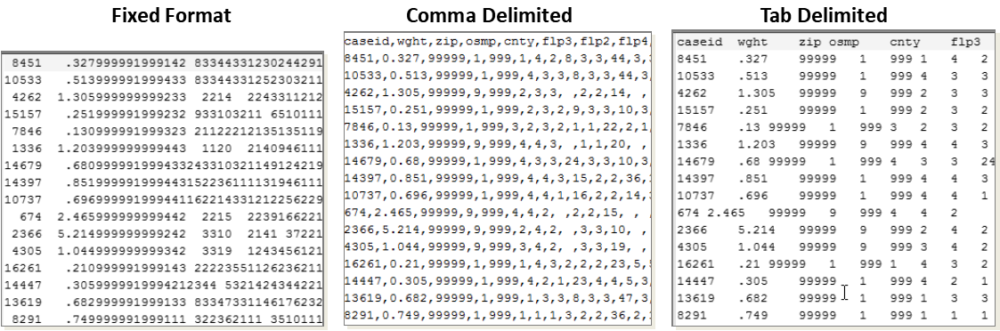

This series is meant for non-programmer researchers who are beginning to use text-based tools and syntax. 

tldr:

- Digital Researchers need to understand the different types of files they work with. 
- Many people make use of Markdown languages without understanding that they are just a part of the Markup ecosystem. 
- The escape character <kbd>\\</kbd> switches a language interpreter between interpreting characters as text and as a special character. 
- Many researchers do not have a programming background and may not be familiar with some concepts. 

<!--more-->

Many people who use digital research methods in academia do not have a computer science or programming background. But, to understand how to work with data and to take advantage of tools for collaboration and replicability, a certain base level of knowledge is useful. This article is my attempt to explain the minimum knowledge researchers should have about text files and the various types of markup. Although some content is specific to tabular data and statistical software, much is also relevant to those in the digital humanities.  

In a previous article on Character Encoding, I explained the difference between **Text Files** and **Binary Files**. Text files are those that use a standard text encoding scheme and can be read by a [text editor](https://www.computerhope.com/jargon/e/editor.htm). Two free, cross-platform editors that work well for handling text files are [Visual Studio Code](https://code.visualstudio.com/) and [Atom](https://atom.io/). For Windows users, [Notepad++](http://notepad-plus-plus.org/) is recommended. Mac or Unix users may find [Komodo Edit](https://www.activestate.com/products/komodo-ide/downloads/edit/), [Kate](https://kate-editor.org/) or [Gedit](https://wiki.gnome.org/Apps/Gedit) useful. [[Text Editors are addressed by the caprentries](https://librarycarpentry.org/lc-overview/06-file-naming-formatting/index.html).]


**[Version control](http://crlionline.net/node/198)** systems like Git, Mercurial, and Subversion are much more useful for Text Files than Binary files. Although most will store both types files, one of the most useful features of such systems is the ability to show line-by-line changes between one version and the next. Files with markup allow for both rich or structured text and the ability to easily see modifications. Further, many version control systems are able to just save the changes to text files, reducing the amount of storage necessary since the entire file is not backed up every time.  To show differences in binary files like Microsoft Word requires [converting it to a text format first](https://git-scm.com/book/en/v2/Customizing-Git-Git-Attributes). 

In general, there are three main types of text files based on how the content is interpreted. There is no standard breakdown, but this is a useful way of classifying files that researchers encounter. 

- **Scripts** - For computer instructions or code. 
- **Documents** - For the display of textual documents for reading.  
- **Data** -  For structured text or numeric data. 

Document and data files typically contain [markup](https://en.wikipedia.org/wiki/Markup_language)--characters or sequences of characters that provide information above and beyond the document text or data.  Software can recognize and interpret these annotations to control the display or processing of a text file. But, individuals can also add their own markup to notate sections you want to keep working on or data that you still need to find. 

An empirical researcher can perform nearly necessary tasks using only text files, as text files are able to store data, process and analyze data, and store the reports. Images would be the primary non-text file type.  

 Scripts use one of many languages to direct the computer to do things. 


Consistency is important for markup. 

Note also that OSX and Windows also differ in how they represent the **End Of Line** (EOL), whether with `\n` (aka LF) or `\r\n` (aka CRLF) respectively. Without going into detail, software and version control programs usually take care of this, but you will see messages and options referring to this. 

## Script Files

In addition to the classic programming languages like C++, Python, and Java, statistical software also have a textual language that can has the ability to save code in a script.  also have  *Every* computer script, **including those for statistical software**, is saved in text format. Thus, files of type .sps, .do, .sas, .R, .py, and .sql, can all be opened and written in any [text editor](https://www.computerhope.com/jargon/e/editor.htm).  

Programming languages are divided into **interpreted** and **compiled** languages. All statistical software uses interpreted languages. Compiled languages like C++ must be converted ("compiled") into binary files in order to run. This can vastly increase speed because the instructions have already been translated into computer code when it is run. 

Stata, R, and Python also support "interactive "programming. That supports one statement or command at a time and shows the output along with the input. A script file, however, contains just the inputted statements and more directly allows the seqeuence of commands to be re-run and the ouput reproduced. If researchers do not save the commands in a script file (e.g., only in output files), then it is far more difficult to redo the processing and analyses. 

### Editors and IDEs

A text editor is the name for any software that can decode and display text files. Some are very simple, and others have many features that can make it easier to write in certain languages. An **I**ntegrated **D**evelopment **E**nvironment, on the other hand, combines a text editor with other tools a language requires like compiling, debugging, and code running. It is typically optimized for a specific language and allows you to run code and manage entire projects. But, some are able to support multiple lagnuages. 

Advanced text editors, IDEs, and built-in script editors allow for features like syntax highlighting and code completion. **Syntax highlighting **refers to the coloring that highlights different aspects of the code. **Code completion** helps you remember and type names related to your data or words commonly used in the language. Many text editors used by programmers support highlighting for many languages and allow users to create their own. Notepad++, for instance, can support all the languages by installing some user-contributed files. 

### Statistical Syntax

Every software language has a **structure**, like a grammar, which is crucial to understand. Being able to look at someone else's syntax and pick out the important words. For traditional software it is usually the first word or few words. For the programming languages (R & Python), it is important to identify the functions (before parentheses)

The table below shows the syntax in the most used quantitative research software that will produce a Contingency Table comparing the variables `q1` and `q2`, with only n (# of observations), row %, and the results of a χ2 test of independence. Lines in italics apply to multiple tasks. 

| Software            | Syntax Example                                               | Comments                                                     |
| ------------------- | ------------------------------------------------------------ | ------------------------------------------------------------ |
| SPSS                | CROSSTABS  <br />     /TABLES= q1 BY q2    <br />     /STATISTICS=CHISQ     <br />     /CELLS=COUNT ROW. | Primarily a point-and-click software <br />with syntax not designed to be typed. <br />Much shorter if defaults are used. |
| Stata               | tabulate q1 q2, obs row chi2                                 | Well-liked due to inherent brevity <br />and other features that reduce typing. |
| SAS                 | *PROC FREQ data=data;*      <br />   table  q1\*q2  <br />        / NOCOL NOPERCENT CHISQ;<br />*RUN;* | Ignoring elements that facilitate multiple <br />statements, it is also quite brief. Tends to <br />include more output by default than others, <br />which required extra syntax to suppress. |
| R                   | *library( summarytools )*<br />ctable(  data$q1, data$q2, chisq=TRUE  ) | Function-based language that relies<br />heavily on supplemental packages <br />(ex. summarytools) designed for your specific task. |
| Python/<br />Pandas | *import pandas as pd<br />from scipy.stats import chi2_contingency*<br />table = pd.crosstab( data.q1, data.q2 )<br />pd.crosstab( data.q1, data.q2, normalize='index' )<br />c, p, dof, exp = chi2_contingency(table) | Python was not designed for this task <br />and no package yet <br />exists to do so. Indeed, the <br />summarytools R package is currently <br />being converted to Python, but as <br />of this writing does not <br />include the ctable function. |

Whether SPSS, STATA, and SAS are or have a "programming language" is a source of debate. However, they are at least "languages", with vocabularies (words *aka* commands or functions) and grammar (word order *aka* syntax). They each have the basic programming abilities to define non-data "variables", create functions and iterate over a list. But, the language is focused on doing data importing, preparation, analysis, and graphing. 

|        | Storage                               | Function                      | File | Type    |
| ------:| ------------------------------------- | ----------------------------- | ---- | ------- |
| SPSS   | `!macro`                              | `!macro`                      | .sps | syntax  |
| STATA  | ``local_macro'` <br />`$global_macro` | `program`                     | .do  | do file |
| SAS    | `&macro_variable`                     | `!macro_program`              | .sas | program |
| R      | `object`                              | `function()`                  | .R   | script  |
| Python | `variable`                            | `function()`<br />`.method()` | .py  | script  |

## Document Files

Learning curve. *Source:* [Dheepak Krishnamurthy](http://blog.kdheepak.com/writing-papers-with-markdown.html), licensed under [CC BY-NC-SA 4.0](https://creativecommons.org/licenses/by-nc-sa/4.0/).


|                                             | File Extensions          | "bold" in Bold Font     | Markup       |
| ------------------------------------------: | ------------------------ | ----------------------- | ------------ |
|                                        HTML | .html, .htm              | `<strong>bold</strong>` | tag          |
|                            Rich Text Format | .rtf , .doc              | `{\b bold}`             | control word |
|                                 TeX / LaTeX | .tex , .sty              | `\textbf{bold}`         | command name |
| Lightweight Markup Languages (ex. Markdown) | .md , .rst , .txt , .Rmd | `**bold**`              | syntax       |

### HTML, XML, and XHTML

This family of markup languages are used both for documents and data (XML only). They are easy to identify from the **tags** surrounded by <>'s. In the example below, the tag is "strong".  

```
This is some <strong>bold</strong> text. 
```

HTML (**H**yper**t**ext **M**arkup **L**anguage) was created in 1990 to control the display of documents on the internet ("hypertext" means text that links to other information). It has a defined set of tags (words) for that purpose. XML (e**X**tensible **M**arkup **L**anguage) is extensible, which means that it can use any set of tags. [XHTML](https://www.w3schools.com/html/html_xhtml.asp) (e**X**tensible **H**yper**t**ext **M**arkup **L**anguage) is XHTML based on XML instead of SGML, an older and more complex markup language that HTML also came from. See more about XML data formats under Data.  Learn more about [HTML](https://www.w3schools.com/html/). 

### RTF / Rich Text Format

[Rich Text format](https://en.wikipedia.org/wiki/Rich_Text_Format) (RTF), was developed by Microsoft in 1987 as an text-based alternative for Microsoft's standard binary document format. Being just text helps facilitate portability to other operating systems, but the standard was not initially shared with others and is not an open format  Because it has been around for so long, it is supported by most document editors. Markdown is now more popular due to its [relative] simplicity, but RTF is still in wide use (ex. Stata's estout). It's use is not always obvious--SPSS puts a .doc extension on its RTF-formatted exported output (though accurately labeled "Word/RTF").  

```
{\pard
This is some {\b bold} text.
}
```

### TeX / LaTeX

LaTeX (["LAH-tech"](https://www.latex-project.org/about/)) is the oldest document markup scheme still in wide use, having been around since 1984. It provides a more comprehensive and user-friendly way of using TeX, which actually implements the formatting. Researchers in the sciences use it to write papers with complex mathematical expressions as well as to make books and slides. Learn more about [LaTeX](https://www.andy-roberts.net/writing/latex). 

```
This is some \textbf{bold} text. 
```

LaTeX markup is similar to RTF in that there are many \\'s and {}'s, but notice that the braces {} here are after the command name ("textbf"), not before. 

### Lightweight Markup Languages

[Lightweight markup languages](https://en.wikipedia.org/wiki/Lightweight_markup_language) (LML), which use fewer extra characters, were initially developed to help create easier-to-read content for the internet. So, they were (and still are) typically intended to be converted to HTML. In the early days of the internet, contributors to Wiki's (collaborative web pages) and forums could not use HTML itself for security reasons.  

Application developers came up with various systems for simplified formatting. For example, Wikipedia developed the wiki engine [MediaWiki](https://en.wikipedia.org/wiki/MediaWiki) with a specialized markup language that allows easy linking to other articles with `[[Article Title]]` . For example, in [many implementations](https://en.wikipedia.org/wiki/Lightweight_markup_language#Comparison_of_lightweight_markup_language_syntax), one put would asterisks around a word to add emphasis. 

The original **Markdown** was created in 2004 and is sometimes mistakenly used to refer to all lightweight markup languages. Like ASCII, the [original implementation](https://www.markdownguide.org/cheat-sheet/) is not used as much directly, and instead has been incorporated into many different "[flavors](https://github.com/commonmark/commonmark-spec/wiki/markdown-flavors)" with additional features (types of formatting). Popular flavors include [GitHub Flavored Markdown](https://github.github.com/gfm/) (GFM) and [RMarkdown](https://rmarkdown.rstudio.com/). 

```
This is some **bold** text. 
```

Popular alternatives to Markdown include [**reS**tructured**T**ext](https://docutils.sourceforge.io/rst.html) (*aka* reST, written in Python) and [AsciiDoc](http://asciidoc.org/). 

## Data Files

Text data files cannot store "metadata" like the proprietary software's binary data files. Metadata includes labels for data, variables, and values as well as identifying complex data types. Text data files contain data, and may also distinguish between string and numeric/log

### Tabular Data

Tabular data is organized into rows and columns, as in spreadsheets (ex. Excel) or statistical software (e.g., "data table").  Each row represents an *observation*, like a person, place, or action. In research data, columns are called *variables* and contain *values* representing characteristics of the observation. The column's descriptor (*aka* variable name) is in the first row. Below is an example of the same data stored in different formats, as viewed in a text editor. All data software can parse each of these formats if given the relevant details. 



**Fixed format** files actually have no markup. Indeed, they often look like big blocks of numbers and *do not have variable names* in the first row. Instead, each variable was allocated a specific number of characters (called columns) and can be identified by position. In the above graphic, for example, the variable "zip" is columns 13-17 (5 characters). If a value does not use all the spaces allotted, it is padded with spaces. 

Fixed format files may also be referred to as **Fixed width** or **Fixed length**. In addition, data labeled as **ASCII** or **flat file**, both generic terms for data in text files, typically refer to fixed format data because other options are labeled accordingly.

**Delimited data files** separate columns with a character--to delimit means to mark the boundaries of something. Quotes are typically used to surround columns with string data, and are called text qualifiers. Any character can be used, but the table below lists the  delimiters you should know about. Comma-delimited files typically have the extension .csv, describing **c**omma-**s**eparated **v**alues. 

Errors in parsing are typically quite obvious, with values in the wrong column or split across multiple rows. If there are only a few errors, identify the very first indication of an error and look to at the previous columns for special characters.   If a text a as well as the **text qualifier** (usually double quotes), which helps define each cell. If values in a column contain line breaks (\n) or the delimiter, the text qualifier will help it distinguish.. If the data has quotes, software will typically *escape* (see below) them for you.

| Delimiter                                              | Possible Extensions | Notes                                                        |
| ------------------------------------------------------ | ------------------- | ------------------------------------------------------------ |
| Comma <kbd>,</kbd>                                     | .csv                | Most common format by far; computers automatically open this in Excel. |
| Tab  <kbd>Tab</kbd><br /> <kbd>\\</kbd> + <kbd>t</kbd> | .tab, .tsv, .txt    | The character is used less in text fields of a spreadsheet, so there are fewer conflicts. But, since tabs are not visible, can confuse some. |
| Pipe <kbd>\|</kbd><br /><kbd>Shift</kbd>+<kbd>\\</kbd> | .dat, <br />.txt    | Rarely used in any text and looks like a column break. But, must be specified in every software. |

#### Fixed Format and Setup Files

When hard drive space was expensive, fixed format was preferred because it contains no extra non-data characters and consequently uses the least space. Thus, it is common for older data files to be in this format. These days, there is no good reason to save data in fixed format because storage is cheap and it is impossible to read without additional information. 

Repositories providing data in fixed format will almost always [provide a **setup file**](https://www.icpsr.umich.edu/web/ICPSR/cms/1976) that must be run to read in the data. It is a script file for a particular statistical software that gives the needed information. Open the script file in the script window of the appropriate software or in any text editor and read the instructions at the top; It may be necessary to edit the script file to specify the location of the data itself. A setup file can only be run in the software it was written for. But, it does contain all the necessary information to specify according to the software of your choice.  If there is no setup file, you will have to use the codebook to determine the necessary information.

### Non-Tabular Data

For **non-tabular** data, JSON or XML can be used. These formats are more versatile as they allow for nested information, which can be visualized as a tree structure. Unlike tabular data, in which the field name is given once as the column header, the field name is specified for each value. Thus, the information can be in any order within a record and a field need not be specified unless there is a value.  

e**X**tensiible **M**arkup **L**anguage (**XML**) grew out of HTML/SGML (see previous) as a general type of markup for any data content and structure. XML treats all values as string, and therefore does not need any to be quoted. Like HTML, tag elements can have attributes, but they are [unneeded](https://www.w3schools.com/xml/xml_dtd_el_vs_attr.asp).

XML allows you to define a specific set of tag words for particular purposes.  XML document formats can be specified with a [**Document Type Definition**](https://www.w3schools.com/xml/xml_dtd_intro.asp) (DTD), written in EBNF, or an [**XML Schema**](https://www.w3schools.com/xml/schema_intro.asp) Definition (XSD), which is written in XML. Many common formats utilize the XML structure, like RSS (for web feeds), and SVG (for vector images). XML is also used for specific purposes like [biographical data](http://projects.oucs.ox.ac.uk/teiweb/Activities/PERS/persw02.xml?splitLevel=-1).

```xml
<students>
  <student>
    <name>Ahmad</name>
    <age>22</age>
    <classes>
        <one>STAT 420</one>
        <two>ENGH 302</two>
    </classes>
  </student>
</students>
```

**J**ava**S**cript **O**bject **N**otation (**JSON**; "[JAY-sun](https://www.youtube.com/watch?v=zhVdWQWKRqM)") integrates well with it's namesake programming language JavaScript, because it matches the internal representation of data. However, it can be used with any language. It was not named until 2001, even though JavaScript itself was created in 1995. 

Like Markdown, JSON is considered "lightweight" (few markup characters), generally leading to smaller files than XML. The words are called **keys** or sometimes **names**, and must be in quotes. Values (after the colon) can be strings (in quotes) or numbers/logical/null (not in quotes). 

```json
{"students":[ { 
  "name":"Ahmad", 
  "age": 22, 
  "classes": {
     "one": "STAT 420", 
     "two": "ENGH 302"
  }
} ]}
```

## Escaping

### Writing Special Characters

In text files with markup, some characters have special meaning. In Markdown for example, using asterisks puts a word in *italics*. So, how would one display an asterisk itself?

- Use the **escape character**:   \*     \\*
- Use an **escape sequence**:    &#42;      \&#42;
- Specify it is a **raw string**:      `*`     \`*\` 

The **escape character** tells the interpreter to change the meaning of the next character. It is the backslash `\` in all major languages and markups. The *back*slash looks like it is leaning *back* toward the beginning of the sentence.  Here are some more examples:

​    `**escape**` = **escape**

​    `\**escape\**` = \**escape\**

​    `\*\*escape\*\*` = \*\*escape\*\*

​    `\\escape\\` = \\escape\\

**Escape sequences** used in **HTML** and **XML** (and thus in Markdown and other LML), start with an `&` and end with `;`. Between, you can use the [character name](https://dev.w3.org/html5/html-author/charref), the decimal code, or the equivalent hex code. For example,  `<` can be written as  `&lt;`,  `&#60;` or `&#x3C;` (note the "x" before the hex code). The character `&` itself should be written as `&amp;`,  `&#38;` or `&#x26;`.  [**URLs**](https://www.w3schools.com/tags/ref_urlencode.ASP) use escape sequences that start with an `%` plus the 2-character ASCII hex code. For example, the space is `%20` and the `&` is `%26`.  **Excel** has the [CHAR function](https://support.office.com/en-us/article/char-function-bbd249c8-b36e-4a91-8017-1c133f9b837a) in which you specify the decimal code 

A **raw string** is a feature of many programming languages to prevent any internal interpretation. In Markdown, formatting text as code will do the same, which can be done by surrounding it in backticks: `` `raw` ``. In Python and R (v4.0+), you put an "r"  in front of a specially quoted string. Python will accept a single quote instead of triple-quotes if you do not need to use quotes inside the string (ex. `r"Hi"`), but R will not. 

> Python:    r"""This is a "raw" string that will print \exactly\\."""
> 
> R (4.0+):    r"(This is a "raw" string that will print \exactly\\.)"

### Backslashes as Switches

The backslash actually works more like a switch. As above, if you put it before a character that is special, it will treat it normally. But, as seen earlier with RTF and LaTeX, the backslash is often used to indicate that that the following characters *are* special (ex. markup). The backslash is also used before specific letters to represent control characters: a tab is `\t` and a line break is `\n`.   Here is an example in Python showing the backslash used in both ways. In R, use the function cat(). 

```Python
print "Hello!\nThis is an \"Expert\" Question:\tWhat does \\n mean?"
```

Once interpreted, this would print: 

> Hello!
> 
> This is an "Expert" Question:    What does \n mean? 

Those, plus many other backlashed sequences are used in **regular expressions** (*aka* **regex**, [technically "re*g*-ex" like "re*g*ular", but often "rej-ex"](https://www.reddit.com/r/programming/comments/adcne/regex_reggex_or_rejex/)), which are a way to find specific characters. Learn more about [Regular Expressions](https://infoguides.gmu.edu/data-work/regex).  However, in languages like R,because the backslash is the escape character, Scripts will tr it is necessary to escape the backslash (ex. `\\n`) or use raw strings when writing these expressions in R and, in some cases, Python. 

Learn more about [Escaping (especially in SPSS and Python)](https://www.spss-tutorials.com/escape-sequence/).

#### Common Issues

There are several **common issues** with escaping in scripts. 

**Quotes** are often special characters because labels, messages, and string-type values must be surrounded by quotes. However, most languages will accept either single or double-quoted strings. Thus, issues can often be solved by using the other quote style (ex. "I don't know" or 'Is it "weird"?'). If that is not sufficient, use the standard backslash escape or a raw string in R or Python, double the quotes in [SPSS](https://www.spss-tutorials.com/escape-sequence/), [SAS](https://documentation.sas.com/?docsetId=lrcon&docsetTarget=p0cq7f0icfjr8vn19vyunwmmsl7m.htm&docsetVersion=9.4&locale=en#p0iwb32yddph1gn1w4q7vdbjbbcn), or [Excel](https://exceljet.net/formula/double-quotes-inside-a-formula), or use compound quotes in [Stata](https://www.stata.com/meeting/5uk/program/quotes1.html). Excel uses a single quote to escape the [equal sign](https://www.computerhope.com/issues/ch001219.htm).

**File Paths in Windows** (the location of the file on the computer) are often a source of problems with languages like R because Windows computers separate folders with a `\`. But the interpreter sees `\` as the start of an escape sequence and tries to interpret the next character accordingly. To specify `\`, you can escape it (`\\`) .  But, modern versions of Windows will also accept the Mac/Linux style of file paths with the forward slash `/`. 

## Related Topics

### WYSIWYG

Many people cannot remember the time when computers could only display plain text. To control the look of the document, users would add tags or control codes--essentially markup--to indicate how the document would look once printed.  When computer displays improved and software took advantage of it, visible markup was unneeded. Writers could make and *see* words bold on the screen, and *get* words in bold when printed--in other words "[What You See Is What You Get](https://bits.blogs.nytimes.com/2007/10/18/the-real-history-of-wysiwyg/)". These were thus called **Rich Text** or WYSIWYG editors and would typically save files in a binary format. 

>  "**W**hat **Y**ou **S**ee **I**s **W**hat **Y**ou **G**et" -> WYSIWYG ("wizzy-wig") 

The desire to see controlling markup has never become obsolete; many writers prefer to more precisely see and control such formatting instructions. Those critical of rich text editors like Microsoft Word have coined a variety of [related acronyms](https://en.wikipedia.org/wiki/WYSIWYG#Related_acronyms). One of the more popular is [What You See Is What You Mean](https://en.wikipedia.org/wiki/WYSIWYM), commonly referring to structural document markups like headers. 

### Tips

One [rule of thumb from the Carpentries](https://librarycarpentry.org/lc-overview/06-file-naming-formatting/index.html) for the difference between markup and rich text is that markup can be found by <kbd>Ctrl</kbd>+<kbd>F</kbd>/<kbd>Command</kbd>+<kbd>F</kbd>. Preferable are simple notation schemes such as using a double-asterisk or three hashes to represent a message:  for example, we could use three question marks to indicate something  that needs follow up, chosen because `???` can easily be found with a <kbd>Ctrl</kbd>+<kbd>F</kbd>/<kbd>Command</kbd>+<kbd>F</kbd> search.

### Conversion Between Formats

[Pandoc](https://pandoc.org/) is a software tool that specializes in converting between different markup formats. It is used by R Markdown, Zotero, and many text editors. It is commonly used to create PDF files from any of those formats by using some extensions built to work with TeX, which has to be installed separately. RMakdown/Knitr uses this to produce pdfs, which is why MiKTeX or TinyTeX or another TeX/LaTeX implementation must be installed.

==From the [carpentries](https://librarycarpentry.org/lc-overview/06-file-naming-formatting/index.html) : Combined with [pandoc](http://pandoc.org/), a Markdown file  can be exported to PDF, HTML, a formatted Word document, LaTeX or other  formats, so it is a great way to create machine-readable, easily  searchable documents that can be repurposed in many ways. This [Programming Historian tutorial](https://programminghistorian.org/en/lessons/sustainable-authorship-in-plain-text-using-pandoc-and-markdown) spells out what to do.==

### Microsoft "x" File Formats

Microsoft's modern "x" formats ([.doc**x**](https://www.toptal.com/xml/an-informal-introduction-to-docx), xls**x**, etc) are actually zipped XML files.  Consequently, this format is more acceptable for long-term preservation than the previous binary versions. If you do not have a standalone unzipper software (like [7-zip](https://www.7-zip.org/) for Windows), just add/change the extension to .zip and use your normal process to unzip it. There will be about a dozen files in different directories, but one is called "document.xml". The image below is an example of that file opened in a a text editor; notice the carets (<>) surrounding the tags indicating it is XML. Recall that a zip file itself is binary, though the standard is well supported. So, depending on the context, .docx may be considered both a binary file and a markup text file. 

