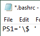

When teaching command line skills, it can be helpful to simplify the prompt to help the students focus on what you are typing. 

<!--more-->

In general, teachers don't want to change defaults, but in this case the prompts on Windows and OSX are so different already, that it isn't an issue. 

Software Carpentries materials show a simple "$" prompt, which is great. 

See these resources for more instructions and the values for specific colors: 

- [How to Customize Bash Colors and Content in Linux Terminal Prompt](https://www.tecmint.com/customize-bash-colors-terminal-prompt-linux/)
- [How to Change the Color of your Linux prompt](https://linuxhostsupport.com/blog/how-to-change-the-color-of-your-linux-prompt/)
- [How to Customize (and Colorize) Your Bash Prompt](https://www.howtogeek.com/307701/how-to-customize-and-colorize-your-bash-prompt/)

To set it temporarily, just type the below into your terminal window. To automatically apply the setting every time, put the same line it in your **.bashrc** file, which is in your user folder (on Windows, C:/Users/*Username*). Make sure to [display hidden files](https://support.microsoft.com/en-us/help/14201/windows-show-hidden-files) if you don't see it. 

*Examples*:

* A simple $ and space:\
	`PS1='\$ '`
	
* The Default on Windows
	
	`PS1='\u@\h:\w\$'`
	
* A $ with a blue background and line numbers:\
	`PS1='\! \[\e[1;37m\]\[\e[44m\]\$\[\e[1;40m\]\[\e[1;37m\] '`
	
* A unix-style prompt:\
	`PS1='\[\e[0;37m\]\[\e[44m\]user:\[\e[42m\]\w\[\e[40m\]\[\e[1;31m\]\$\[\e[1;37m\] '` 

