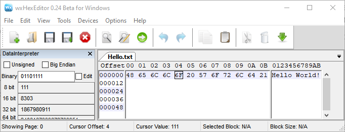

tldr:

- Computers process and store everything as **binary**. 
- **Codes** are used to represent one thing (e.g., a character) as something else (e.g., a number)
- **ASCII** and **Unicode** (ex. UTF-8) are two common ways of coding characters as numbers. Unicode includes ASCII as well as nearly all other languages known to exist. 

<!--more-->

Many people who use digital research methods in academia do not have a computer science or programming background. But, to understand how to work with data, a certain base level of knowledge is useful. This article is my attempt to explain the minimum knowledge researchers should have about character encodings. Although some content is specific to software for statistical analysis, much is also relevant to those in the digital humanities.  

Research is now more dependent on computers than ever. Knowing some basic computer concepts will help understand the logic of some software elements that confuse many new researchers. 

## Bits and Bytes

*For a deeper and more pictorial introduction to the following topics, see Kahn Academy's [Data & Binary](https://www.khanacademy.org/computing/computer-science/computers-and-internet-code-org/how-computers--work/v/khan-academy-and-codeorg-binary-data) video which discusses why computers use binary, describes the binary number system, and introduces how computers represent text, images, and sounds with numbers. Or, learn about the same topics (plus Hexadecimal) by reading [Binary and data representation](https://www.bbc.co.uk/bitesize/topics/zd2xsbk) from BBC's Bitesize GCSE Lessons.* 

### Binary

Computers store and represent information using electricity in transistors, which can have only two states: **on** and **off**. It is common to represent those two states in **Binary** as `1` and `0`. These binary digits (`1`'s and `0`'s) are referred to as **bits**, which is short for **b**inary dig**it**. 

> Terminology: 
>
> - [**bit**](https://en.wikipedia.org/wiki/Bit): Each `1` or` 0` is called a "**bit**", from <u>**bi**</u>nary dig<u>**it**</u>.  
> - [**byte**](https://en.wikipedia.org/wiki/Byte): A group of **8 bits** together is called a "**byte**" , ex. `1100 1000`
>

Even though each bit (binary digit) can have only two values, combining multiple bits can allow us to represent more complex ideas. The [**binary number system**](https://www.mathsisfun.com/binary-number-system.html) shows one way to do this. In this animated image, you can see how 5 bits are assigned place values, which allows 32 different combinations to be interpreted as the numbers from 0 to 31. 

[Image by Ephert, Wikipedia, CC BY-SA 4.0](https://commons.wikimedia.org/w/index.php?curid=38752676)

In binary, for example, `1101` is 13, and `1100 1000` is 200.  It is common to group binary digits in groups of 4 for ease of reading. A group of 8 bits, or two groups, is also called a **byte**. Representing 200 (`1100 1000`) takes 1 byte, as it needs 8 bits (binary digits).

{}

The actual definition of byte depended on the given computer processor and how many bits it treated as a unit. Although that can (and did) vary, a byte is 8 bits for all modern non-CS purposes. -

{}

### Hexadecimal

[**Hexadecimal**](https://www.mathsisfun.com/hexadecimals.html) or "Hex" is a base-16 system, meaning that each character can have 16 values (represented with`0`-`9` + `A`-`F`). Writing binary can get tedious, so it is more common to write in hexadecimal.  Just 2 hex characters can represent 1 byte (8 bits).  For example, the decimal number 200 is `C8` in hexadecimal. Because some hex values use only 0-9 and can be mistaken as decimal, values are often prefixed with `0x`, like `0xC8`.  

| Number System | Base | Possible Values                 | Example           |
| ------------- | ---- | ------------------------------- | ----------------- |
| Binary        | 2    | 0 1    "bit"                    | `1100 1000`       |
| Decimal       | 10   | 0 1 2 3 4 5 6 7 8 9    "digit"  | 200               |
| Hexadecimal   | 16   | 0 1 2 3 4 5 6 7 8 9 A B C D E F | `C8 ` *or* `0xC8` |

### Amounts

Terms you have no doubt seen that use the words bit or byte refer directly to these concepts. A [64-bit operating system](https://www.digitaltrends.com/computing/32-bit-vs-64-bit-operating-systems/) can work with 64 bits at a time, 2^64^, vs a 32-bit operating system, which can only work with 232. Because the difference is exponential, a 64-bit system has far more than just double the capability of a 32-bit system, it is over 4 billion times greater. 

When exploring disk storage and processing capacities, you have probably also seen words like **Kilobyte** (KB), **Megabyte** (MB), **Gigabyte** (GB), etc. They do indeed refer to actual number of bits that can be stored or processed at once. See more [common technologies in bits and bytes](http://www.wu.ece.ufl.edu/links/dataRate/DataMeasurementChart.html). 

For the larger measures, computers and hard disk manufacturers are not referring to the same thing, however. Hard disk manufacturers use the traditional metric system, in which a *kilo*byte is 1,000 bytes.  But, because computers use the binary system, the operating system considers a kilobyte to be 1,024 bytes (2^10^, 10 bits). Thus, a "1 TB" hard drive shows as only 931 GB. 

|                 |      | To the Computer | To Disk Manufacturers |
| --------------- | ---- | --------------- | --------------------- |
| 1 byte          | =    | 8 bits          | 8 bits                |
| 1 kilobyte (KB) | =    | 1,024 bytes     | 1,000 bytes           |
| 1 megabyte (MB) | =    | 1,024 KB        | 1,000 KB              |
| 1 gigabyte (GB) | =    | 1,024 MB        | 1,000 MB              |
| 1 terabyte (TB) | =    | 1,024 GB        | 1,000 GB              |
| 1 petabyte (PB) | =    | 1,024 TB        | 1,000 TB              |

{}

A little bit of history: The image most commonly used to represent saving (&#128190;) is a representation of a [3 &frac12; inch floppy disk]([https://en.wikipedia.org/wiki/Floppy_disk#%E2%80%8B3_1%E2%81%842-inch_floppy_disk](https://en.wikipedia.org/wiki/Floppy_disk#3_1⁄2-inch_floppy_disk)), which was introduced in the early 1980s. Earlier versions were actually [floppy](https://en.wikipedia.org/wiki/Floppy_disk) (🖬), but that one was not. The original version could store around 400 Kilobytes (KB);  Later versions could hold about 1.5 Megabytes (MB). These days, USB drives given away as swag often hold at least 4 gigabytes (GB), almost 3,000 times more. 

{}

Since a computer's processing and storage capabilities are tied to bits and bytes, understanding what affects data size can be particularly important with large data files to improve speed and efficiency. 

## Text Encoding Schemes

### Codes and Coding

If computers can only store and process `1`'s and `0`'s, and by extension larger numbers, how does it do so many things? 

Consider [**Morse Code**](https://en.wikipedia.org/wiki/Morse_code), developed over a century before computers. Messages were often sent by using groups of long or short burst of sound or dots and dashes, also just two options. When people agreed on which sequences represented each letter and number (the "code"), they could communicate over long distances. 

There are standard ways to represent text, images, and video using numbers, called **encodings**. Because everybody uses the same coding scheme, programs can store, retrieve, and process all those things. 

This article will only address how bits and bytes represent text. See the resources at the beginning of this section to learn more about other data types.

### ASCII

**ASCII** (pronounced "ask-ee") was one of the first text coding schemes to get wide use, It was published in 1963 by what is now the American National Standards Institute (ANSI), and was last updated in 1986.  It assigned a meaning to values from 0 to 127 were each assigned a meaning. In binary, those values take 7-bits, and the final bit of the byte was used for error checking. These 128 codes are important because they are still used today.

ASCII included all the **characters** you would have found on a standard US (English) keyboard [in the 1950s](https://books.google.com/books?id=AouyCwAAQBAJ&pg=PA46&lpg=PA46&dq=when+was+the+keyboard+layout+symbols+ascii&source=bl&ots=vSlo79JIyZ&sig=ACfU3U3LIgxxAJePTbxpQd-q3qoLeom-ew&hl=en&sa=X&ved=2ahUKEwjx7uXRg8PqAhWooXIEHci5DpAQ6AEwGHoECAsQAQ#v=onepage&q=when%20was%20the%20keyboard%20layout%20symbols%20ascii&f=false "pg 46") with just a few additional symbols. Modern US keyboards exactly match the characters included. See the table below for examples of the codes for various characters, including 37 as "%", 65  as "A", and 97 as "a".  The bytes representing 0 through 32 are codes for non-printing "[Control Characters](https://en.wikipedia.org/wiki/Control_character)", including obsolete commands like a bell/beep, but also the horizontal tab (9) and the space (32). 

Examples of ASCII. For the full list, see an [ASCII Conversion Chart](http://web.alfredstate.edu/faculty/weimandn/miscellaneous/ascii/ascii_index.html). 

| Character        | Binary      | Decimal | Hex  |
| ---------------- | ----------- | ------- | ---- |
| <kbd>Space</kbd> | `0010 0000` | 32      | `20` |
| %                | `0010 0101` | 37      | `25` |
| 0                | `0011 0000` | 48      | `30` |
| 1                | `0011 0001` | 49      | `31` |
| a                | `0100 0001` | 65      | `41` |
| A                | `0110 0001` | 97      | `61` |
| ~                | `0111 1110` | 176     | `7E` |

As the table shows, **numbers** also have a code. For example, 48 is "0", 49 is "1", and so on. Those codes are not completely arbitrary. In binary, 49 is `0011 0001`. The last 4 bits (`0001`) is 1, and thus matches the number. The last 4 bits of "A" and "a" are both `0001` as well. 

It is important to understand that **a number can be a character** like any letter *and* thusly encoded as a *different* number. Software must be able to determine whether to interpret `0011 0001` as 49 or "1", or something else entirely.  It is convention to put the *encoded* character representation in quotes, and leave the direct numeric representation bare. 

A **character** thus refers to each letter, number, space, punctuation mark or symbol represented by these codes. Multiple characters together are called a **string**. Look for one of these terms to help identify when you need to surround your data with quote marks so that your data is interpreted correctly as codes.

### Extended ASCII

As computers became more reliable, error checking became unnecessary and people realized they could give meaning to the 8th bit. By assigning characters to the numbers 128 to 255 they could represent additional characters and languages. Most of these [**code pages**](https://en.wikipedia.org/wiki/Code_page#Windows_.28ANSI.29_code_pages) just added on to ASCII. But, even with another 128 characters, it was difficult, if not impossible, to write documents in many Asian languages, much less documents in multiple languages. 

Even if you never come across a file that was encoded with one of these code pages, you will likely see references to them. The most common English/Latin standards were **[ISO-8859-1](https://en.wikipedia.org/wiki/ISO/IEC_8859-1)** (aka "Latin-1") and the equivalent **[Windows-1252](https://en.wikipedia.org/wiki/Windows-1252)** (not identical, but close enough). The term [ANSI](https://en.wikipedia.org/wiki/Code_page#Windows_.28ANSI.29_code_pages) may take on different meanings--just know that it represents a code page typically used by Windows. The prefixes [ISO, OEM, or Windows](http://www.iana.org/assignments/character-sets/character-sets.xhtml) are used to indicate code pages. 

## Unicode

[**Unicode**](https://www.unicode.org/standard/WhatIsUnicode.html) was developed in 1991 to avoid the need for so many code pages ("uni" = "one", "one code"). [The consortium](http://unicode.org/main.html) has assigned a code to each character in [nearly](https://www.nytimes.com/2017/10/18/magazine/how-the-appetite-for-emojis-complicates-the-effort-to-standardize-the-worlds-alphabets.html) [all of the world's languages](https://www.unicode.org/charts/). For compatibility, the first 127/256 codes were kept the same as ASCII and ISO-8859-1, so both of those standards are compatible.   

Unicode values are referred to using *hexadecimal* and written with U+####. So, "A" is still represented by the decimal number 65, but is written `U+0041`. Unicode allows for [over a million codes](https://www.johndcook.com/blog/2019/09/02/number-of-possible-unicode-characters/), up to U+10FFFF. 

The codes written using 4 hex digits, up to 65,536 characters, are called the the Basic Multilingual plane (BMP). This includes nearly all *modern* languages, and more symbols. Six hex digits includes the supplemental planes, which allows for archaic languages like cuneiform, [Emoji](https://www.nytimes.com/2017/10/18/magazine/how-the-appetite-for-emojis-complicates-the-effort-to-standardize-the-worlds-alphabets.html), and specialized symbols (ex. musical notes and playing cards: U+1F0A1= **🂡** ). 

If you know its code, you can directly type [any character into Microsoft Word](https://support.office.com/en-us/article/insert-ascii-or-unicode-latin-based-symbols-and-characters-d13f58d3-7bcb-44a7-a4d5-972ee12e50e0). For example, ± has the code `U+00B1`. To insert it, type <kbd>b</kbd> <kbd>1</kbd> then press <kbd>Alt</kbd>+<kbd>x</kbd>. 

| Unicode Values      | Description                                                  | Contents                                                     | Bytes in UTF-8 | Bytes in UTF-16 |
| ------------------- | ------------------------------------------------------------ | ------------------------------------------------------------ | -------------- | --------------- |
| U+0000 - U+007F     | ASCII                                                        | Everything on a standard English keyboard                    | 1              | 2               |
| U+0080 - U+07FF     | Basic Multilingual Plane (BMP)                               | [Latin languages](https://en.wikipedia.org/wiki/Plane_(Unicode)#Basic_Multilingual_Plane), Greek, Cyrillic and some Aramaic | 2              | 2               |
| U+0800 - U+FFFF     | BMP *continued...*                                           | Remaining *modern* languages                                 | 3              | 2               |
| U+010000 - U+10FFFF | Supplemental [Planes](https://en.wikipedia.org/wiki/Plane_(Unicode)) | Archaic languages, [Emoji](https://www.nytimes.com/2017/10/18/magazine/how-the-appetite-for-emojis-complicates-the-effort-to-standardize-the-worlds-alphabets.html) | 4              | 4               |

### Implementations

Unicode is the general term for this coding scheme but there are multiple ways it can be implemented, labeled with UTF and UCS. **UTF-8** is by far the most-used because it allows ASCII characters to just take up 1 byte (8 bits). This means the file is *identical* to an ASCII-encoded file if only those characters are used. Because all of HTML (web page language)  and most punctuation uses just ASCII characters, [UTF-8 is the standard](https://www.w3.org/International/questions/qa-choosing-encodings) on the internet. 

**UTF-8** still supports all of Unicode, but just takes additional bytes to do so (see Table). It uses 2 bytes to represent the codes U+0080 to U+07FF, [3 bytes](https://en.wikipedia.org/wiki/Comparison_of_Unicode_encodings) to represent the remaining codes up to U+FFFF, and 4 bytes past that. **UTF-16**, however, stores all characters up to U+FFFF in 2 bytes. The extra bits in UTF-8 are needed to indicate how many bytes are used for the character. 

Even with the same encoding, characters that look the same may be stored differently. For example, ê could be stored as `U+00EA` (*composed*) or as the combination of e  `U+0065` and  ̂  `U+0302` (*decomposed*). Further, Unicode groups characters by language and not-infrequently gives different codes to [seemingly-identical characters](https://en.wikipedia.org/wiki/Duplicate_characters_in_Unicode). The standard includes [normalization charts](http://www.unicode.org/charts/normalization/) for each language. Most statistical software has a function to utilize this: Stata has [ustrnormalize](https://www.stata.com/manuals/m-5ustrnormalize.pdf), SPSS has [NORMALIZE](https://www.ibm.com/support/knowledgecenter/SSLVMB_23.0.0/spss/base/syn_transformation_expressions_string_functions.html), R has the [stringi](https://cran.r-project.org/web/packages/stringi/index.html) package, and Python has the [Unicodedata](https://docs.python.org/3/library/unicodedata.html) package.  

You can see the actual bytes of a file using a Hex Editor, like [wxHexEditor](https://sourceforge.net/projects/wxhexeditor/). This screenshot shows the contents of a simple text file with "Hello World!"

### Speed

Computers can work faster when you can...

... use **fewer bytes** vs more bytes. Compared to UTF-8, UTF-16 would store ASCII characters in 2 bytes instead of 1 (more bytes), but those from U+0080 to U+FFFF in 2 bytes instead of 3 (fewer bytes).  

... use **fixed width** vs [variable width](https://en.wikipedia.org/wiki/Variable-width_encoding) encodings. Variable width requires the computer to confirm the number of bytes being used for each character, which may take a little extra time. UTF-16 is essentially fixed width, with most characters taking 2 bytes. ASCII format is also fixed width, with all characters being 1 byte. UTF-8 is variable width because it may use 1, 2, or 3 bytes to represent characters. 

... assume a **character is one byte**. Standard string functions in SAS and Stata (ex. to extract characters) make this assumptions. Separate functions were built for Unicode characters and will not make that assumption, such as [SAS](https://documentation.sas.com/?docsetId=nlsref&docsetTarget=p1pca7vwjjwucin178l8qddjn0gi.htm&docsetVersion=9.4&locale=en0)'s "K" functions, and [Stata](https://www.stata.com/features/overview/unicode/)'s "u" functions. In Python, there is also distinction between regular [unicode strings](https://docs.python.org/3/howto/unicode.html) ('A') and byte strings (b'A'). 

### Non-English Languages

Most modern software supports Unicode, which means it can store and display any character in any language with [quite limited exceptions](http://www.unicode.org/standard/unsupported.html) (ex. new languages). Unicode even supports [right-to-left languages](http://unicode.org/faq/bidi.html) and bidirectional text, but not all programs interpret that characteristic and may display such characters in the wrong order. Also, any given font may not include all possible characters or symbols.  

The consortium compiles information about how different [programming languages use Unicode](https://unicodebook.readthedocs.io/programming_languages.html). If you will be working often with non-English text, you should read the documentation to learn more about details not covered here. 

## Encoding and Decoding

### File Formats

Although every computer file is made up of bits, there is not an inherent way to know how those bits should be interpreted. A program that interpret the bits as ASCII codes could be given any file and will decode the bits accordingly. But, if a file's bits are not intended to be interpreted that way, it will not be interpretable.

The **file extension** is a common way to communicate how the bits should be interpreted, and further indicate which software program the file is meant to be opened with. The extension is the part of the file name that is after the [final] period, such as `.pdf` and `.docx`. It is usually, but not always, 3 or 4 characters.  It is needed for Windows computers, so most people will include one, and Macs also utilize that information. You may need to [change a setting for your computer](https://www.howtogeek.com/205086/beginner-how-to-make-windows-show-file-extensions/) to display these, which you should because they convey important information. Changing the file extension alone does not change how the file is encoded, and should be avoided. 

The **Media type** or **MIME type** is another way computers share information about file encoding.  Common types include `text/csv` and `image/png`. The part before the slash only has 10 recognized types, each of which can have any number of [more specific subtypes](http://www.iana.org/assignments/media-types/media-types.xhtml). This information is not stored in a file itself, but rather is stored with other file information (*metadata*) by the [operating system]( https://www.howtogeek.com/192628/mime-types-explained-why-linux-and-mac-os-x-dont-need-file-extensions/) and is reported when a file is being shared on the internet. In practice, it is common to determine the type from the file extension, or by scanning the file contents for patterns. 

> MIME stands for **M**ultipurpose **I**nternet **M**ail **E**xtensions, reflecting that it was created to help computers interpret and identify emails and their attachments. 

The **content of the file** also provides clues about what it might contain. Even files that are overall not intended to be decoded as text will include bits representing coded text at the beginning for identification purposes. For example, if you open a .png image file in a program that interprets the bits as ASCII codes, you will clearly see "PNG" at the top (in hex `50 4E 47`), even though the rest is un-interpretable. Most other formats are also well-defined, allowing identification even if there is no other information (ex. [JHOVE](http://jhove.openpreservation.org)).

### Newlines and Line Endings

There are two ASCII codes relating to ending a line of text, which are collectively called **E**nd **o**f **L**ine ("EOL") codes: the **C**arriage **R**eturn (ASCII 13 or `0x0D`) and the **L**ine **F**eed (ASCII 10 or `0x0A`). These are what you get when you use <kbd>Enter</kbd> or <kbd>Return</kbd> (which can also produce different characters!). The fact that there are two goes back to the typewriter. [Even worse](https://blog.codinghorror.com/the-great-newline-schism/), which is saved in your file also depends on your operating system. Windows actually uses both CR and LF, whereas Unix computers use LF. Macs also use LF since OSX, but before that used just CR!

Modern software typically compensates for the difference in line endings (finally including Windows' Notepad since 2018). For example, the version control software [Git will automatically convert](https://docs.github.com/en/github/using-git/configuring-git-to-handle-line-endings) them to Unix/OSX style and display messages related to this encoding issue. Although uncommon, this can be a source of errors with programming languages that rely on line endings like Stata and Python, or when reading data. 

### Errors

Although most software uses Unicode now, there is still some software that does not support it.  When text originally encoded as Unicode is decoded as ASCII or another format, you may see unusual characters that are pictorial (ƒ �), coded (`\x99`), or garbled  (“). Some common situations that result in these kinds of errors include:

- [**smart quotes**](https://support.office.com/en-us/article/smart-quotes-in-word-702fc92e-b723-4e3d-b2cc-71dedaf2f343) with [different opening and closing versions](https://www.cl.cam.ac.uk/~mgk25/ucs/quotes.html) are not in ASCII ( “ vs " )
  “Hi”  =  “Hi”   
- **[byte order mark (BOM)](https://en.wikipedia.org/wiki/Byte_order_mark)** at the beginning specifying the format (some details, like endianness, are not addressed here). It is not always used, in part because it may be [interpreted as a weird character](https://www.johndcook.com/blog/2019/09/07/excel-r-bom/)
- "[Big List of Naughty Strings](https://github.com/minimaxir/big-list-of-naughty-strings)" which includes characters that have been known to cause problems with software. 

Errors in decoding will at least produce obvious errors. But, because these make the data uninterpretable by humans, it is important to use the correct scheme to encode and decode your data.  

## Further Reading

- [The Absolute Minimum Every Software Developer Absolutely, Positively Must Know About Unicode and Character Sets (No Excuses!)](https://www.joelonsoftware.com/2003/10/08/the-absolute-minimum-every-software-developer-absolutely-positively-must-know-about-unicode-and-character-sets-no-excuses/)
- [How Unicode Works: What ever devloper needs to know about strings and 🦄](https://deliciousbrains.com/how-unicode-works/)
- [What Every Programmer Absolute, Positively Needs to Know About Encodings and Character Sets to Work With Text](https://kunststube.net/encoding/)
- [An Encoding Primer](https://danielmiessler.com/study/encoding/)
- [Unicode, UTF8 & Character Sets: The Ultimate Guide](https://www.smashingmagazine.com/2012/06/all-about-unicode-utf8-character-sets/)
