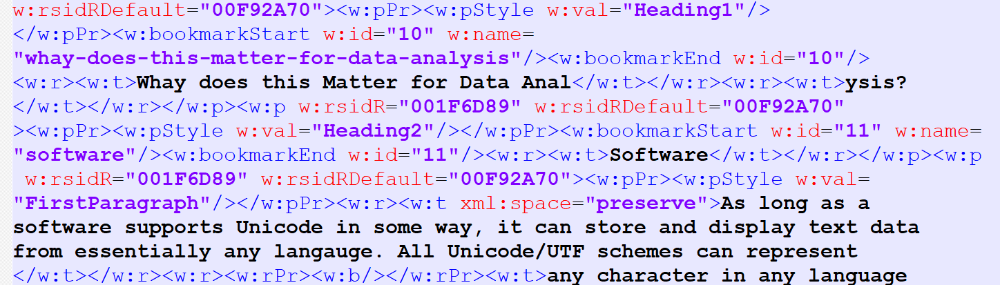

## Document Files

[Pandoc](https://pandoc.org/) is software that can convert between [different document markup formats](https://pandoc.org/), including HTML and LaTeX. It can also convert from and to Microsoft Word documents (see this [tutorial](https://programminghistorian.org/en/lessons/sustainable-authorship-in-plain-text-using-pandoc-and-markdown)) and create PDF files. Consequently, it is used by R Markdown, Zotero, and many text editors. To convert markup formats to PDF files pandoc utilizes some extensions built to work with TeX. To use RMakdown/Knitr,  MiKTeX, TinyTeX or another TeX/LaTeX implementation must be installed.

Learning curve. *Source:* [Dheepak Krishnamurthy](http://blog.kdheepak.com/writing-papers-with-markdown.html), licensed under [CC BY-NC-SA 4.0](https://creativecommons.org/licenses/by-nc-sa/4.0/).

|                                              Type | File Extensions          | Put "bold" in Bold      | Term for Markup |
| ------------------------------------------------: | ------------------------ | ----------------------- | --------------- |
|                                              HTML | .html, .htm              | `<strong>bold</strong>` | tag             |
|                                  Rich Text Format | .rtf , .doc              | `{\b bold}`             | control word    |
|                                       TeX / LaTeX | .tex , .sty              | `\textbf{bold}`         | command name    |
| Lightweight Markup Languages  (ex. Markdown) | .md , .rst , .txt , .Rmd | `**bold**`              | syntax          |

### HTML, XML, and XHTML

This family of markup languages are used both for documents and data (XML only). They are easy to identify from the **tags** surrounded by <>'s. HTML (**H**yper**t**ext **M**arkup **L**anguage) was created in 1990 to control the display of documents on the internet ("hypertext" means text that links to other information). It has a defined set of tags (words) for that purpose.  As shown In the table, the tag "strong" makes a word bold. Learn more about [HTML](https://www.w3schools.com/html/). 

XML (e**X**tensible **M**arkup **L**anguage) is extensible, which means that it can use any set of tags. [XHTML](https://www.w3schools.com/html/html_xhtml.asp) (e**X**tensible **H**yper**t**ext **M**arkup **L**anguage) is XHTML based on XML instead of SGML, an older and more complex markup language that HTML also came from. See more about XML data formats under Data.  

### RTF / Rich Text Format

[Rich Text format](https://en.wikipedia.org/wiki/Rich_Text_Format) (RTF), was developed by Microsoft in 1987 as an text-based alternative for Microsoft's standard binary document format. just text helps it transfer to other operating systems easier, but the standard was not initially shared with others and is not open. But, it is still  Other fis now more popular due to its [relative] simplicity, but RTF is grandfathered in to many software (ex. Stata's estout). It's use is not always obvious--SPSS puts a .doc extension on its RTF-formatted exported output (though accurately labeled "Word/RTF").  

### TeX / LaTeX

LaTeX (pronounced ["LAH-tech"](https://www.latex-project.org/about/)) is the oldest document markup scheme still in wide use, having been around since 1984. It provides a more comprehensive and user-friendly way of using TeX, which actually implements the formatting. Researchers in the sciences use it to write papers with complex mathematical expressions as well as to make books and slides. LaTeX files are most often Learn more about [LaTeX](https://www.andy-roberts.net/writing/latex). 

Some people distinguish between a *typesetting* language, which specifies formatting, and a *markup* language, which identifies the structure of the document. TeX, having been originally created to correctly format mathematical equations, is specified as a typesetting language, whereas LaTeX adds the identification of document structure. 

### Lightweight Markup Languages

[Lightweight markup languages](https://en.wikipedia.org/wiki/Lightweight_markup_language) (LML), which use fewer extra characters, were initially developed to help create easier-to-read content for the internet. So, they were (and still are) typically intended to be converted to HTML. In the early days of the internet, contributors to Wiki's (collaborative web pages) and forums could not use HTML itself for security reasons, so application developers came up with various systems for simplified formatting. For example, Wikipedia developed the wiki engine [MediaWiki](https://en.wikipedia.org/wiki/MediaWiki) with a specialized markup language that allows easy linking to other articles with `[[Article Title]]` . There was a lot of similarity in the various schemes; for example, in [many implementations](https://en.wikipedia.org/wiki/Lightweight_markup_language#Comparison_of_lightweight_markup_language_syntax), one put would asterisks around a word to add emphasis. 

The original **Markdown** was created in 2004 and is sometimes mistakenly used to refer to all lightweight markup languages. Like ASCII, the [original implementation](https://www.markdownguide.org/cheat-sheet/) is not used as much directly, and instead has been incorporated into many different "[flavors](https://github.com/commonmark/commonmark-spec/wiki/markdown-flavors)" with additional features (types of formatting). Popular flavors include [GitHub Flavored Markdown](https://github.github.com/gfm/) (GFM) and [RMarkdown](https://rmarkdown.rstudio.com/).  

Popular alternatives to Markdown include [**reS**tructured**T**ext](https://docutils.sourceforge.io/rst.html) (*aka* reST, written in Python) and [AsciiDoc](http://asciidoc.org/). 

### Microsoft's "x" File Formats

Microsoft's modern "x" formats ([.doc**x**](https://www.toptal.com/xml/an-informal-introduction-to-docx), xls**x**, etc) are actually zipped XML files.  Consequently, this format is more acceptable for long-term preservation than the previous binary versions.  Recall that a zip file itself is binary, though the standard is well supported. So, depending on the context, .docx may be considered both a binary file and a markup text file. 

To see the XML for yourself, you will need to unzip the file. If you do not have a standalone unzipper software (like [7-zip](https://www.7-zip.org/) for Windows), just add/change the extension to .zip and use your normal process to unzip it. In a docx file, there will be about a dozen files in different directories, but one is called "document.xml". The image below is an example of that file opened in a a text editor; notice the carets (<>) surrounding the tags indicating it is XML.

