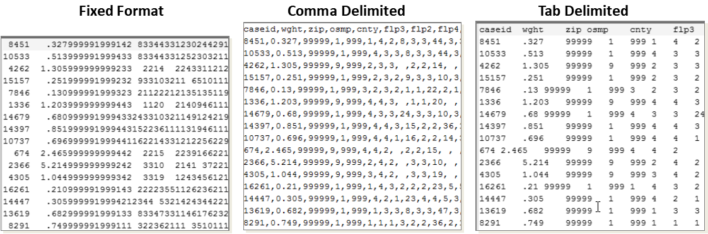
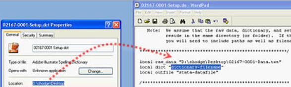

## Data Files

Text data files cannot store "metadata" like the proprietary software's binary data files. Metadata includes labels for data, variables, and values as well as identifying complex data types. Text data files contain data, and may also distinguish between string and numeric/logical. 

Data **serialization** is a programming term for writing arbitrary data structures to a file. Such files can be text or binary, but there are several standard text formats. In Python, `pickle` is the standard library to do so.

### Tabular Data

Tabular data is organized into rows and columns, as in spreadsheets (ex. Excel) or statistical software (e.g., "data table").  Each row represents an *observation*, like a person, place, or action. In research data, columns are called *variables* and contain *values* representing characteristics of the observation. In programming languages, the word variable refers to any word or character that represents another value. The column's descriptor (*aka* variable name) is in the first row. Below is an example of the same data stored in different formats, as viewed in a text editor. All data software can parse each of these formats if given the relevant details. 



**Fixed format** (*aka* **Fixed width** or **Fixed length**) files actually have no markup. Indeed, they often look like big blocks of numbers and *do not have variable names* in the first row. Instead, each variable was allocated a specific number of characters (called columns) and can be identified by position. In the above graphic, for example, the variable "zip" is columns 13-17 (5 characters). If a value does not use all the characters allotted, spaces are used. 

Data labeled as **ASCII** or **flat file**, both generic terms for data in text files, are also typically fixed format---other types are much more likely to be labeled accordingly. But, data repositories almost always have instructions about how to make use of their files. 

[*Excerpt from Setup File Instructions*](https://www.icpsr.umich.edu/web/ICPSR/cms/1976)

It is common for older data files to be in fixed format because hard drive space was scare and/or expensive and this format has no non-data characters. With drive space now relatively inexpensive, there is no longer any good reason to save data in fixed format. Indeed, fixed format files require instructions in order to read the data, which can too easily get separated and/or lost. 

Repositories that provide data in fixed format will almost always [include a **setup file**](https://www.icpsr.umich.edu/web/ICPSR/cms/1976) that must be run to read in the data. That is a script file for a particular statistical software that gives the needed information. Open the file in the script window of the appropriate software or in any text editor and read the instructions at the top. It may be necessary to edit the script file to specify the location of the data itself.t does contain all the necessary information to specify according to the software of your choice.  If there is no setup file, you will have to use the codebook to determine the necessary information.

**Delimited data files** separate columns with a character (to delimit means to mark the boundaries of something). Any character can be used, but the table below lists the delimiters you should know about. Spreadsheet software will typically handle this type of file easily, but may need to be told what the delimiter is. Comma-delimited files are the most common and typically have the extension .csv, which stands for **c**omma-**s**eparated **v**alues. 

| Delimiter                                              | Possible Extensions | Notes                                                        |
| ------------------------------------------------------ | ------------------- | ------------------------------------------------------------ |
| Comma <kbd>,</kbd>                                     | .csv                | Most common format by far; computers typically open this in Excel. |
| Tab  <kbd>Tab</kbd><br /> <kbd>\\</kbd> + <kbd>t</kbd> | .tab, .tsv, .txt    | The character is used less in text fields of a spreadsheet, so there are fewer conflicts. But, since tabs are less visible, can confuse. |
| Pipe <kbd>\|</kbd><br /><kbd>Shift</kbd>+<kbd>\\</kbd> | .dat, <br />.txt    | Rarely used in any text and looks like a column break. But, must be specified in every software. |

Errors in parsing delimited files are typically quite obvious, with values in the wrong column or split across multiple rows. If there are only a few errors, identify the very first indication of an error and look to at the previous columns for special characters.  If a text a as well as the **text qualifier** (usually double quotes), which helps define each cell. If values in a column contain line breaks (\n) or the delimiter, the text qualifier will help it distinguish.. If the data has quotes, software will typically *escape* (see below) them for you.

### Non-Tabular Data

For **non-tabular** data, JSON or XML can be used. These formats are more versatile as they allow for nested information, which can be visualized as a tree structure.  Unlike tabular data, in which the field name is given once as the column header, the field name is specified for each value. Thus, the information can be in any order within a record and  a field need not be specified unless there is a value.  Thus, if there are many missing values, 

e**X**tensiible **M**arkup **L**anguage (**XML**) grew out of HTML/SGML (see previous) as a general type of markup for any data content and structure. XML treats all values as string, and therefore does not use quotes. Like HTML, tag elements can have attributes, but they are [unneeded](https://www.w3schools.com/xml/xml_dtd_el_vs_attr.asp).

XML allows you to define a specific set of tag words for particular purposes.  XML document formats can be specified with a [**Document Type Definition**](https://www.w3schools.com/xml/xml_dtd_intro.asp) (DTD), written in EBNF, or an [**XML Schema**](https://www.w3schools.com/xml/schema_intro.asp) Definition (XSD), which is written in XML. Many common formats utilize the XML structure, like RSS (for web feeds), and SVG (for vector images). XML is also used for specific purposes like [biographical data](http://projects.oucs.ox.ac.uk/teiweb/Activities/PERS/persw02.xml?splitLevel=-1).

```xml
<students>
  <student>
    <name>Ahmad</name>
    <age>22</age>
    <classes>
        <one>STAT 420</one>
        <two>ENGH 302</two>
    </classes>
  </student>
</students>
```

**J**ava**S**cript **O**bject **N**otation (**JSON**; "[JAY-sun](https://www.youtube.com/watch?v=zhVdWQWKRqM)") integrates well with it's namesake programming language JavaScript, because it matches the internal representation of data. However, it can be used with any language, and most have built-in support for it. JSON was not named until 2001, even though JavaScript itself was created in 1995. 

Like Markdown, JSON is considered "lightweight" (few markup characters), generally leading to smaller files than XML. The field identifiers (ex. "age") are called **keys** or sometimes **names**, and must be in quotes. Values (after the colon) can be strings (in quotes) or numbers/logical/null (not in quotes). 

```json
{"students":[ { 
  "name":"Ahmad", 
  "age": 22, 
  "classes": {
     "one": "STAT 420", 
     "two": "ENGH 302"
  }
} ]}
```

**YAML** ("[yaamel](https://yaml.org/spec/history/2001-05-26.html)") is currently used for configuration files and not traditional datafiles, but has similar abilities. Indeed, YAML is structured to allow [JSON as a subset](https://en.wikipedia.org/wiki/YAML#Comparison_with_JSON) (e.g., it can parse JSON). Because YAML was designed to used alongside document markup in order to create web pages (like with [Hugo](https://gohugo.io/), which was used for this article) it is even more "lightweight". But it is more difficult to see the data structure, especially when additional features are included, like internal comments. 

```yaml
students:
	- name: Ahmad
      age: 22
      classes: [STAT 420, ENGH 302]
```

