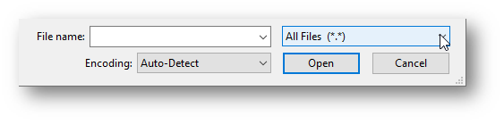
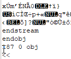

### File Types

The makers of a software decide whether the files it produces should be saved and interpreted according to ASCII/Unicode rules or not. If so, `11001000` will be "A" and so on. But, that same byte could represent anything the programmer desires. That leads to the two types of files: 

- **Text files** are intended to be decoded into readable characters using one of the standardized text coding schemes (aka human-readable)
- **Binary files** are not. The bits or bytes can take on any meaning. 

An empirical researcher can perform nearly all necessary tasks using only text files, as text files are able to store data, process and analyze data, and store the reports. Image files would be the exception, since the most common ones are binary. 

#### Text File Extensions

Many (many) different types of files are **Text** and can be easily examined in a [text editor](https://www.computerhope.com/jargon/e/editor.htm). Examples include: 

- **Script files:** .R, .py, .bat, .sps, .do, .sas, .sql
- **Data files:** .csv, .tab, .tsv, .por, .json, .xml
- **Document files:** .rtf, .ipynb, .md, .rmd, .html, .log, .tex
- **many others:** .ris, .bib, .eml, .ics

Most of these text files also include [Markup](https://en.wikipedia.org/wiki/Markup_language) that gives information to software on how the text is structured or how it should display. When you open the file in a text editor instead of the designated software, you can see and edit the instructions along with the content. 

#### Determining File Type

Operating systems are built to automatically open each file with the intended software, and do not indicate whether a file is Text or Binary. But, it is a useful characteristic to know. **To find out**, try opening the file in a [text editor](https://www.computerhope.com/jargon/e/editor.htm) like Notepad (Windows), TextEdit (Mac), [Notepad++](https://notepad-plus-plus.org/) (Windows), [Atom](https://atom.io/), or even Microsoft Word. When doing so on a Windows computer, you may need to select "All Files" in the drop-down box on the lower right, as seen below. 



Once opened in a text editor, it is usually easy to tell if you are seeing the contents of a binary file: lots of gibberish on lines of widely varying size. A wrongly decoded document tends to have a more consistent structure and less gibberish. For reference, this is what a small section of a **binary pdf file** looks like when opened in Notepad++ (left) and Notepad (right). 

||

#### Long-term Preservation

**Text files** are typically preferred for [long term storage and preservation](https://www.ukdataservice.ac.uk/manage-data/format/recommended-formats) of data and documentation because the content can be read in a text editor even if the original software is unavailable. However, even though pdf files are binary, it is a [good preservation format](https://www.loc.gov/preservation/digital/formats/fdd/fdd000318.shtml) because is an open standard and well-supported.  

**Data files** produced by statistical software are typically binary (ex. .sav, .dta, .sas7bdat). Although it is good to preserve the original file because it contains additional metadata, it is best to also save data in a text format. Because text formats do not store labels and other data information, be sure to make a codebook and store it with the file. See article.

- [**Delimited**](https://en.wikipedia.org/wiki/Delimiter-separated_values): Text format where the columns are separated by a symbol. For example, the file extension .csv refers to **c**omma-**s**eparated **v**alues.  
- **SPSS**: The text .por format (for "portable") was meant for data transfer. 
- **R**:  Writes binary files by default, but all functions have an option to use ASCII. 
- **Python**: The `pickle` module will default to saving data as a text file, but allows saving as binary for improved efficiency and smaller file size. 

### WYSIWYG

Many people cannot remember the time when computers could only display plain text. To control the look of the document, users would add tags or control codes--essentially markup--to indicate how the document would look once printed.  When computer displays improved and software took advantage of it, visible markup was unneeded. Writers could make and *see* words bold on the screen, and *get* words in bold when printed--in other words "[What You See Is What You Get](https://bits.blogs.nytimes.com/2007/10/18/the-real-history-of-wysiwyg/)". These were thus called **Rich Text** or WYSIWYG editors and would typically save files in a binary format. 

>  "**W**hat **Y**ou **S**ee **I**s **W**hat **Y**ou **G**et" -> WYSIWYG ("wizzy-wig") 

The desire to see controlling markup has never become obsolete; many writers prefer to more precisely see and control such formatting instructions. Those critical of rich text editors like Microsoft Word have coined a variety of [related acronyms](https://en.wikipedia.org/wiki/WYSIWYG#Related_acronyms). One of the more popular is [What You See Is What You Mean](https://en.wikipedia.org/wiki/WYSIWYM), commonly referring to structural document markups like headers. 

### Why Text Files?

In a previous article on Character Encoding, I explained the difference between **Text Files** and **Binary Files**. Text files are those that use a standard text encoding scheme and can be read by a [text editor](https://www.computerhope.com/jargon/e/editor.htm), or even a document editor like **Microsoft Word**. Two free, cross-platform editors that work well for handling text files are [Visual Studio Code](https://code.visualstudio.com/) and [Atom](https://atom.io/). For Windows users, [Notepad++](http://notepad-plus-plus.org/) is recommended. Mac or Unix users may find [Komodo Edit](https://www.activestate.com/products/komodo-ide/downloads/edit/), [Kate](https://kate-editor.org/) or [Gedit](https://wiki.gnome.org/Apps/Gedit) useful. [[Text Editors are addressed by the caprentries](https://librarycarpentry.org/lc-overview/06-file-naming-formatting/index.html).]

Free Text Editors:

- [Visual Studio Code](https://code.visualstudio.com/) 
- [Atom](https://atom.io/)
- [Notepad++](http://notepad-plus-plus.org/) (Windows only)
- [Komodo Edit](https://www.activestate.com/products/komodo-ide/downloads/edit/)
- [Kate](https://kate-editor.org/)
- [Gedit](https://wiki.gnome.org/Apps/Gedit) 

**[Version control](http://crlionline.net/node/198)** systems like Git, Mercurial, and Subversion are much more useful for Text Files than Binary files. Although most will store both types files, one of the most useful features of such systems is the ability to show line-by-line changes between one version and the next. Files with markup allow for both rich or structured text and the ability to easily see modifications. Further, many version control systems are able to just save the changes to text files, reducing the amount of storage necessary since the entire file is not backed up every time.  To show differences in binary files like Microsoft Word requires [converting it to a text format first](https://git-scm.com/book/en/v2/Customizing-Git-Git-Attributes). 

## Escaping

### Writing Special Characters

In text files with markup, some characters have special meaning. In Markdown for example, using asterisks puts a word in *italics*. So, how would one display an asterisk itself?

​		Use the **escape character**:   \*     \\*

​		Use an **escape sequence**:    &#42;      \&#42;

​		Specify it is a **raw string**:      `*`     \`*\` 

The **escape character** tells the interpreter to change the meaning of the next character. It is the backslash `\` in all major languages and markups. The *back*slash looks like it is leaning *back* toward the beginning of the sentence.  Here are some more examples:

​		`**escape**` = **escape**  							`\**escape\**` = \**escape\**

​		`\*\*escape\*\*` = \*\*escape\*\*   			`\\escape\\` = \\escape\\

An **escape sequence** is used in documents and can take on a few different forms, referring to the character's ASCII or Unicode value. In **HTML** and **XML** they start with an `&` and end with `;`. Between, you can use the [character name](https://dev.w3.org/html5/html-author/charref), the decimal code, or the equivalent hex code.  **URL** [escape sequences](https://www.w3schools.com/tags/ref_urlencode.ASP) use an `%` then the 2-character ASCII hex code.

The decimal and hexadecimal values are also In **HTML** and **XML** = start with an `&` and end with `;`. Between, you can use the [character name](https://dev.w3.org/html5/html-author/charref), the decimal code, or the equivalent hex code.  **URL** [escape sequences](https://www.w3schools.com/tags/ref_urlencode.ASP) use an `%` then the 2-character ASCII hex code. See below for examples:

**Internet URLs** currently can only use ASCII characters. In addition, spaces and special characters can cause problems with interpretation. To address these issues, [URLs convert characters](https://www.w3schools.com/tags/ref_urlencode.ASP) to a percent sign and up to a 2 character hex code. For example, many people have noticed `%20` in a URL: recall that the decimal code for the space is 32, which is `0x20` in hex. 

| Character | Name       | Decimal    | Hex         | URL     |
| --------- | ---------- | ---------- | ----------- | ------- |
| **<**     | \&**lt**;  | \&#**60**; | \&#x**3C**; | %**3C** |
| **&**     | \&**amp**; | \&#**38**; | \&#x**26**; | %**26** |
| space     | *multiple* | \&#**32**; | \&#x**20**; | %**20** |

A **raw string** is a feature of many programming languages to prevent any internal interpretation. In Markdown, formatting text as code will do the same, which can be done by surrounding it in backticks: \`raw\`. In Python and R (v4.0+), you put an "r"  in front of a specially quoted string. Python will accept a single quote instead of triple-quotes if you do not need to use quotes inside the string (ex. `r"Hi"`), but R will not. 

```
r"""This is a "raw" string that will print \exactly\\."""   # Python
r"(This is a "raw" string that will print \exactly\\.)"     # R (4.0+)
```

> This is a "raw" string that will print \exactly\\\\\.

### Backslashes as Switches

The backslash actually works more like a switch. As above, if you put it before a character that is special, that character will be treated normally. But, as seen earlier with RTF and LaTeX, the backslash is often used to indicate that that the following characters *are* special (ex. markup). The backslash is also used before specific letters to represent control characters: a tab is `\t` and a line break is `\n`.   Here is an example in Python showing the backslash used in both ways. In R, use the function cat() with the same string.

```Python
print "Hello!\nThis is an \"Expert\" Question:\tWhat does \\n mean?"
```

Once interpreted, this would print: 

> Hello!
>
> This is an "Expert" Question:    What does \n mean? 

#### Common Issues

There are several **common issues** related to backslashes and escaping in scripts. 

**Quotes** are often special characters because labels, messages, and string-type values must be surrounded by quotes. But, sometimes the content needs to include quotes as well. Most languages will accept either single or double-quoted strings. Thus, if you have a string with double-quotes, use outer single quotes and vice versa. Here are additional options for relevant software. Learn more about [Escape Sequences](https://www.spss-tutorials.com/escape-sequence/) from a data perspective.

| Software                                                     | What to do                                             | Example                                   |
| ------------------------------------------------------------ | ------------------------------------------------------ | ----------------------------------------- |
| Most software                                                | Use the opposite quote type                            | 'Is it "bad"?'                            |
| R or Python                                                  | Escape the quotes<br />Use a raw string                | "Is it \\"bad\\"?"<br />r"(Is it "bad"?)" |
| [SPSS](https://www.spss-tutorials.com/escape-sequence/), [SAS](https://documentation.sas.com/?docsetId=lrcon&docsetTarget=p0cq7f0icfjr8vn19vyunwmmsl7m.htm&docsetVersion=9.4&locale=en#p0iwb32yddph1gn1w4q7vdbjbbcn), or [Excel](https://exceljet.net/formula/double-quotes-inside-a-formula) | Double the quotes                                      | "Is it ""bad""?"                          |
| [Stata](https://www.stata.com/meeting/5uk/program/quotes1.html) | Use compound quote<br />(backtick ` + single quote ' ) | \`Is it "bad"?\'                          |

**File Paths in Windows** (the location of the file on the computer) are often a source of problems with languages like R because Windows computers separate folders with a backslash. Mac and Linux computers use the forward slash for file paths. The interpreter sees `\` as the start of an escape sequence and tries to interpret the next character accordingly, leading to errors. To specify file paths in R, you can:

- Use Mac/Linux Style:      "C:**/**Users**/**Name**/**Documents**/**Project"
- Escape the Separator :   "C:**\\\\**Users**\\\\**Name**\\\\**Documents**\\\\**Project"

**End of Line (EOL) characters**, aka newlines, also differ between Mac/Linux and Windows. Without going into detail, software and version control programs usually take care of this, but you will see messages and options referring to this. Windows programs do not always recognize a Mac-style newline as a line break, which breaks languages that rely on it, such as Stata and Python. 

* Mac/Linux: 	 `\n`  	LF	**L**ine **F**eed
* Windows: 	 `\r\n` 	CRLF	**C**arriage **R**eturn + **L**ine **F**eed
* Old Macs:	 `\r` 		CR	**C**arriage **R**eturn

**Regular Expressions** (*aka* **regex**, [technically "re*g*-ex" like "re*g*ular", but often "rej-ex"](https://www.reddit.com/r/programming/comments/adcne/regex_reggex_or_rejex/)), are a language of searching and replacing, particular characters in strings. It is very common in data cleaning and uses the escape sequences for newlines and tabs as well as many others. In R, and for some characters in Python, it is necessary to escape the regex backslash (ex. `\\n`) or use raw strings when writing these expressions.  Learn more about [Regular Expressions](https://infoguides.gmu.edu/data-work/regex).

```
gsub("\\b(\\w)", "\\U\\1", txt, perl=TRUE)   # see help(grep)
```

### Markup

Some people use tools like highlighting in order to mark values or sections to return to. But, with text files, that type of formatting does not always save properly. So, when using text files, you will want to use characters or numbers that are distinctive and  easy to find to represent special cases. For example, it is common to use extreme numbers like 999 to indicate missing values. Writers may use ??? to represent a section that needs follow-up, or ## to mark where references need to be checked. You know if something is markup becuase it cand be found by text search with <kbd>Ctrl</kbd>+<kbd>F</kbd>/<kbd>Command</kbd>+<kbd>F</kbd> (see [rule of thumb from the Carpentries](https://librarycarpentry.org/lc-overview/06-file-naming-formatting/index.html)). 

