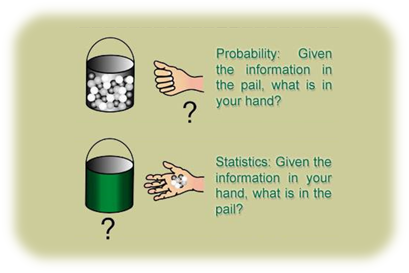

Adapted from James Orlin, Network Optimization, Spring 2003. (Massachusetts Institute of Technology: MIT OpenCouseWare), http://ocw.mit.edu (Accessed 2016-07-13). License: Creative Commons BY-NC-SA. http://dspace.mit.edu/bitstream/handle/1721.1/74617/15-082j-spring-2003/contents/chp_probability_stat.jpg

**Probability:** Given the information in **the pail**, what is in **your hand**?

**Statistics:**    Given the information in **your hand**, what is in **the pail**? 

