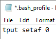

To further put the focus on what the students must type themselves, you can change the color of the output to be more muted. 

<!--more-->

You might want to experiment with coloring, but on my Windows computer, this made the output greyish: 

`tput setaf 0` 

Put this in **.bash_profile**

See [Bash Prompt Howto: Colors and Cursor Movement With tput](http://www.tldp.org/HOWTO/Bash-Prompt-HOWTO/x405.html)

